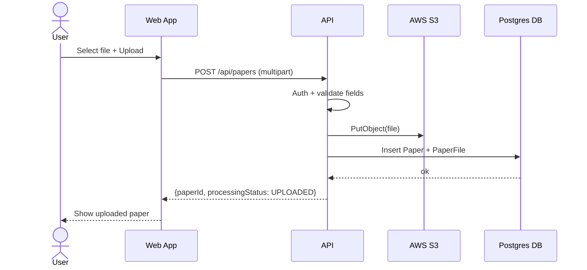
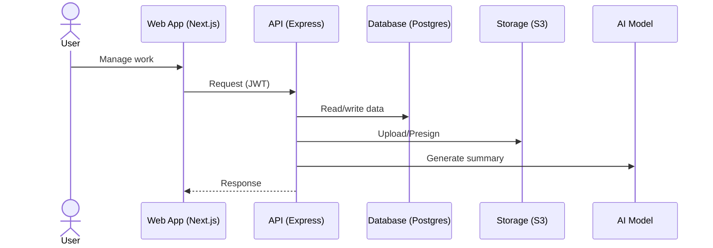
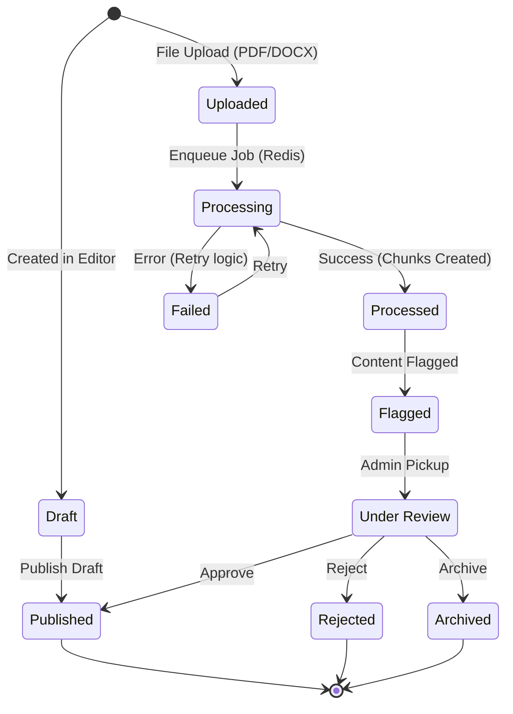
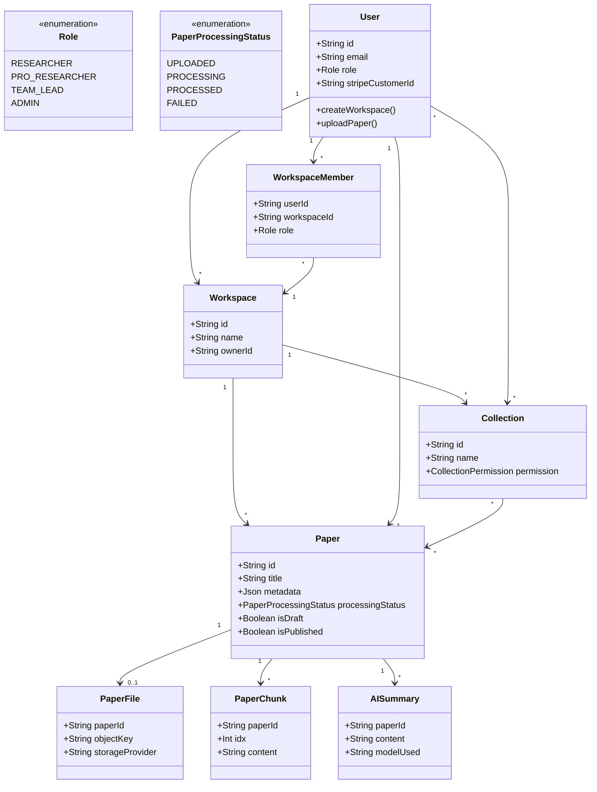

# Chapter 4 — System Design (Diagram Drawing Spec)

This document is a **diagram-drawing blueprint** for ScholarFlow. It is written so you can recreate the system design diagrams in **Figma / Lucidchart / Draw.io** by copying the **exact node labels** and **arrow labels**.

Scope (MVP + adjacent modules already present in codebase): **Auth**, **User Profile**, **Workspaces**, **Collections**, **Papers + Editor**, **AI Summary/Insights**, **Citations**, **Discussions**, **Activity Log**, **Billing (Stripe)**.

---

## 0) Notation + Naming (use everywhere)

### 0.1 Shape legend (recommended)

- **External Actor**: stick figure
- **External System**: rectangle
- **ScholarFlow (System Boundary)**: big container box
- **Internal Component**: rectangle with component name
- **DFD Process**: rounded rectangle (P1, P2, …)
- **DFD Data Store**: open-ended rectangle (D1, D2, …)
- **Data Flow**: arrow with a _noun phrase_ label

### 0.2 Environments / endpoints (labels)

- **Frontend (Next.js)**: “ScholarFlow Web App (Next.js)”
- **Backend (Express)**: “ScholarFlow API (Express)”
- **API base path**: `/api/*`
- **Important route groups**:
  - `/api/auth` (register/login/oauth, sessions, verify email, forgot/reset)
  - `/api/user`
  - `/api/workspaces`
  - `/api/collections`
  - `/api/papers`
  - `/api/editor`
  - `/api/citations`
  - `/api/discussions`
  - `/api/activity-log`
  - `/api/billing`
  - `/api/health`

### 0.3 Core actors (use these names)

- **Guest User** (not signed in)
- **Authenticated User** (signed in)
- **Workspace Owner**
- **Workspace Member**
- **Collection Owner**
- **Collection Member**
- **Admin**

Role enum (backend): `RESEARCHER | PRO_RESEARCHER | TEAM_LEAD | ADMIN`

---

## 1) Context Diagram (System Context)

### 1.1 Context diagram goal

Show ScholarFlow as a single system and all external parties/systems it communicates with.

### 1.2 Nodes (copy/paste labels)

| Node ID | Label (exact)                                       | Type               | Notes                                |
| ------- | --------------------------------------------------- | ------------------ | ------------------------------------ |
| A1      | Guest User                                          | External Actor     | Browses, registers, logs in          |
| A2      | Authenticated User                                  | External Actor     | Uploads papers, collaborates         |
| A3      | Admin                                               | External Actor     | Admin endpoints, moderation, ops     |
| E1      | OAuth Provider (Google)                             | External System    | OAuth sign-in                        |
| E2      | OAuth Provider (GitHub)                             | External System    | OAuth sign-in                        |
| E3      | Email Service (SMTP/Gmail)                          | External System    | Verification, reset, invites         |
| E4      | Stripe                                              | External System    | Billing + webhooks                   |
| E5      | AI Provider (OpenAI/Gemini/Deepseek)                | External System    | Summaries, insights                  |
| E6      | AWS S3 (Object Storage)                             | External System    | Paper files, previews, editor images |
| E7      | Document Conversion Service (Gotenberg/LibreOffice) | External System    | DOC/DOCX → PDF preview               |
| E8      | Redis (Queue/Cache)                                 | External System    | Background processing queue          |
| S1      | ScholarFlow Web App (Next.js)                       | Internal Component | UI, NextAuth client flows            |
| S2      | ScholarFlow API (Express)                           | Internal Component | REST API under `/api/*`              |
| S3      | PostgreSQL Database                                 | Internal Component | Prisma/Postgres core store           |

### 1.3 Edges (copy/paste arrow labels)

| From | To  | Arrow label (exact)                          | Protocol/Notes         |
| ---- | --- | -------------------------------------------- | ---------------------- |
| A1   | S1  | Browse public pages, start auth              | HTTPS                  |
| A2   | S1  | Use dashboard, manage work                   | HTTPS                  |
| S1   | S2  | API requests (JWT/session)                   | HTTPS JSON + multipart |
| S2   | S3  | Read/write app data                          | SQL (Prisma)           |
| S2   | E6  | Upload/download objects, presign URLs        | S3 API                 |
| S2   | E3  | Send verification/reset/invite emails        | SMTP                   |
| S2   | E1  | OAuth token exchange / profile fetch         | OAuth                  |
| S2   | E2  | OAuth token exchange / profile fetch         | OAuth                  |
| S2   | E4  | Create checkout/session, manage subscription | Stripe API             |
| E4   | S2  | Stripe webhooks (billing events)             | `/webhooks/stripe`     |
| S2   | E5  | Generate summary/insights                    | HTTPS                  |
| S2   | E7  | Convert document to preview PDF              | HTTPS                  |
| S2   | E8  | Enqueue/process background jobs              | Redis                  |

### 1.4 Optional Context Diagram (Mermaid)

Use only as a quick validator; draw final in Figma/Lucid.

```mermaid
flowchart LR
  A1[Guest User] -->|Browse, start auth| S1[ScholarFlow Web App (Next.js)]
  A2[Authenticated User] -->|Use dashboard| S1
  S1 -->|API requests (JWT/session)| S2[ScholarFlow API (Express)]
  S2 -->|Read/write app data| S3[(PostgreSQL Database)]

  S2 -->|OAuth| E1[OAuth Provider (Google)]
  S2 -->|OAuth| E2[OAuth Provider (GitHub)]
  S2 -->|Emails| E3[Email Service (SMTP/Gmail)]
  S2 -->|Billing API| E4[Stripe]
  E4 -->|Webhooks (/webhooks/stripe)| S2
  S2 -->|Summaries/Insights| E5[AI Provider (OpenAI/Gemini/Deepseek)]
  S2 -->|Objects + presigned URLs| E6[AWS S3 (Object Storage)]
  S2 -->|DOC/DOCX→PDF| E7[Document Conversion Service (Gotenberg/LibreOffice)]
  S2 -->|Jobs/Queue| E8[Redis (Queue/Cache)]
```

---

---

## 2) Use Case Diagram + Descriptive Forms

### 2.1 Use case diagram: actors

ScholarFlow exposes a single role enum in the backend: `RESEARCHER | PRO_RESEARCHER | TEAM_LEAD | ADMIN`. The table below maps every actor used in the diagrams to that enum so role-based permissions stay consistent.

| Actor ID | Actor name                           | Role enum mapping                              | Notes / Responsibilities                                                                  |
| -------- | ------------------------------------ | ---------------------------------------------- | ----------------------------------------------------------------------------------------- |
| ACT-01   | Guest User                           | —                                              | Not authenticated; can browse marketing pages, register, request password reset, verify.  |
| ACT-02   | Researcher (default authenticated)   | `RESEARCHER`                                   | Baseline signed-in user; can join workspaces, upload/view papers within quota.            |
| ACT-03   | Pro Researcher                       | `PRO_RESEARCHER`                               | Paid tier; inherits Researcher rights plus AI features and larger quotas.                 |
| ACT-04   | Team Lead / Workspace Owner          | `TEAM_LEAD`                                    | Creates/owns workspaces, manages billing, invitations, approvals, and workspace settings. |
| ACT-05   | Workspace Member                     | `RESEARCHER` or `PRO_RESEARCHER` (invited)     | Any authenticated user invited into a workspace; permissions derived from membership.     |
| ACT-06   | Collection Owner / Collection Member | `RESEARCHER`, `PRO_RESEARCHER`, or `TEAM_LEAD` | Derived from workspace membership; permissions scoped by collection role (VIEW/EDIT).     |
| ACT-07   | Admin                                | `ADMIN`                                        | Platform-level operator for moderation, compliance, billing overrides, feature flags.     |

### 2.2 Use case diagram: use cases (core)

Use these IDs as your ellipse labels.

| UC ID | Use case name (exact)                     | Primary actor(s)             | Role scope                                                               | Related API groups                    |
| ----- | ----------------------------------------- | ---------------------------- | ------------------------------------------------------------------------ | ------------------------------------- |
| UC-01 | Register Account (Email/Password)         | Guest User                   | Guest (pre-auth) selects eventual Researcher/Pro/Team Lead role          | `/api/auth`                           |
| UC-02 | Login (Email/Password)                    | Guest User                   | Guest (pre-auth)                                                         | `/api/auth`                           |
| UC-03 | Login (OAuth: Google/GitHub)              | Guest User                   | Guest (pre-auth)                                                         | `/api/auth`                           |
| UC-04 | Verify Email                              | Authenticated User           | Researcher, Pro Researcher, Team Lead, Admin (self-verification)         | `/api/auth`                           |
| UC-05 | Request Password Reset                    | Guest User                   | Guest (pre-auth)                                                         | `/api/auth`                           |
| UC-06 | Reset Password                            | Guest User                   | Guest (pre-auth)                                                         | `/api/auth`                           |
| UC-07 | View/Update Profile                       | Authenticated User           | Researcher, Pro Researcher, Team Lead, Admin (profile owner)             | `/api/user`                           |
| UC-08 | Create Workspace                          | Authenticated User           | Pro Researcher, Team Lead, Admin (acting on behalf)                      | `/api/workspaces`                     |
| UC-09 | Invite Member to Workspace                | Workspace Owner              | Team Lead (owner) or Admin (override)                                    | `/api/workspaces` + Email             |
| UC-10 | Accept/Decline Workspace Invitation       | Workspace Member             | Researcher, Pro Researcher, Team Lead (invitee)                          | `/api/workspaces`                     |
| UC-11 | Create Collection                         | Authenticated User           | Researcher, Pro Researcher, Team Lead (workspace member)                 | `/api/collections`                    |
| UC-12 | Invite Member to Collection               | Collection Owner             | Collection Owner (Researcher/Pro/Team Lead) or Admin override            | `/api/collections` + Email            |
| UC-13 | Accept/Decline Collection Invitation      | Collection Member            | Researcher, Pro Researcher, Team Lead (invitee)                          | `/api/collections`                    |
| UC-14 | Upload Paper (PDF/DOCX/DOC)               | Authenticated User           | Researcher, Pro Researcher, Team Lead, Admin (audit upload)              | `/api/papers` + S3                    |
| UC-15 | View Paper (metadata + file access)       | Authenticated User           | Workspace members (Researcher/Pro/Team Lead) and Admin (read-only)       | `/api/papers` + S3                    |
| UC-16 | Generate Preview (DOC/DOCX)               | Authenticated User           | Researcher, Pro Researcher, Team Lead                                    | `/api/papers` + Conversion + S3       |
| UC-17 | Process Paper (extract + chunk)           | Authenticated User (trigger) | Researcher, Pro Researcher, Team Lead trigger; Admin can force reprocess | `/api/papers` + Redis + DB            |
| UC-18 | Create Draft in Editor                    | Authenticated User           | Researcher, Pro Researcher, Team Lead                                    | `/api/editor`                         |
| UC-19 | Update Draft Content                      | Authenticated User           | Researcher, Pro Researcher, Team Lead                                    | `/api/editor`                         |
| UC-20 | Publish Draft                             | Authenticated User           | Researcher, Pro Researcher, Team Lead (with publish permission)          | `/api/editor`                         |
| UC-21 | Generate AI Summary                       | Authenticated User           | Researcher, Pro Researcher, Team Lead (feature-flag dependent)           | `/api/papers` + AI Provider           |
| UC-22 | Generate AI Insights (thread/messages)    | Authenticated User           | Researcher, Pro Researcher, Team Lead (feature-flag dependent)           | `/api/papers` + AI Provider           |
| UC-23 | Add Paper to Collection                   | Collection Member (EDIT)     | Collection Member with EDIT permission (Researcher/Pro/Team Lead)        | `/api/collections`                    |
| UC-24 | Remove Paper from Collection              | Collection Member (EDIT)     | Collection Member with EDIT permission (Researcher/Pro/Team Lead)        | `/api/collections`                    |
| UC-25 | Export Citations                          | Authenticated User           | Researcher, Pro Researcher, Team Lead                                    | `/api/citations`                      |
| UC-26 | Start Discussion Thread                   | Workspace/Collection Member  | Researcher, Pro Researcher, Team Lead                                    | `/api/discussions`                    |
| UC-27 | Post Discussion Message                   | Workspace/Collection Member  | Researcher, Pro Researcher, Team Lead                                    | `/api/discussions`                    |
| UC-28 | View Activity Log                         | Authenticated User           | Researcher (own events), Pro Researcher, Team Lead, Admin (all events)   | `/api/activity-log`                   |
| UC-29 | Manage Subscription                       | Authenticated User           | Team Lead (workspace owner) and Admin (billing override)                 | `/api/billing` + Stripe               |
| UC-30 | Admin Operations                          | Admin                        | Admin only                                                               | `/api/admin`                          |
| UC-31 | Moderate Flagged Paper                    | Admin                        | Admin only                                                               | `/api/admin/papers`, `/api/papers`    |
| UC-32 | Manage User Roles & Workspace Escalations | Admin                        | Admin only                                                               | `/api/admin/roles`, `/api/workspaces` |
| UC-33 | Run System Health & Compliance Checks     | Admin                        | Admin only                                                               | `/api/admin`, `/api/health/*`         |

### 2.3 Use case descriptive forms (copy/paste templates)

Below are the **recommended** descriptive forms for the most important flows. Use the same headings in your SRS/Chapter 4.

#### UC-01 — Register Account (Email/Password)

- **Primary Actor**: Guest User
- **Trigger**: User submits registration form
- **Inputs (UI fields)**: `firstName`, `lastName`, `email`, `institution?`, `fieldOfStudy?`, `password`, `role?`
- **Preconditions**: User is not authenticated
- **Postconditions (Success)**: `User` created; session/JWT issued; verification email may be sent
- **Main Flow**:
  1. User enters details and submits.
  2. Web App calls API to create user.
  3. API validates and stores user.
  4. API responds with auth/session payload.
- **Alternative/Exception Flows**:
  - Email already used → return validation error.
  - Weak password → return validation error.
- **Related API**: `/api/auth` (register)
- **Primary Data Stores**: `User`

#### UC-02 — Login (Email/Password)

- **Primary Actor**: Guest User
- **Trigger**: User submits login form
- **Inputs (UI fields)**: `email`, `password`, `rememberMe?`
- **Preconditions**: Account exists and is not deleted
- **Postconditions (Success)**: Session/JWT issued; user is authenticated in Web App
- **Main Flow**:
  1. User enters email/password.
  2. Web App calls API.
  3. API validates credentials.
  4. API returns auth/session payload.
- **Alternative/Exception Flows**:
  - Invalid credentials → return auth error.
- **Related API**: `/api/auth` (login/signin)
- **Primary Data Stores**: `User`, `Session`

#### UC-03 — Login (OAuth: Google/GitHub)

- **Primary Actor**: Guest User
- **Trigger**: User clicks “Continue with Google/GitHub”
- **Inputs**: OAuth authorization code (provider callback)
- **Preconditions**: Provider account accessible
- **Postconditions (Success)**: `Account` linked; `User` created/updated; session established
- **Main Flow**:
  1. Web App redirects user to OAuth provider.
  2. Provider returns authorization code.
  3. API exchanges code for tokens.
  4. API fetches profile and upserts `User`/`Account`.
  5. API issues session/JWT.
- **Related Systems**: OAuth Provider (Google/GitHub)
- **Related API**: `/api/auth` (oauth)
- **Primary Data Stores**: `User`, `Account`, `Session`

#### UC-04 — Verify Email

- **Primary Actor**: Authenticated User
- **Trigger**: User clicks verification link from email
- **Inputs**: `token`
- **Preconditions**: Verification token exists and not expired (policy-defined)
- **Postconditions (Success)**: `User.emailVerified` set; `emailVerificationToken` cleared
- **Main Flow**:
  1. API validates token.
  2. API updates user record.
  3. Web App shows verified state.
- **Related Systems**: Email Service
- **Related API**: `/api/auth` (verify-email)
- **Primary Data Stores**: `User`

#### UC-05 — Request Password Reset

- **Primary Actor**: Guest User
- **Trigger**: User submits “Forgot password” form
- **Inputs**: `email`
- **Preconditions**: User account exists (or return generic success to prevent enumeration)
- **Postconditions (Success)**: Password reset email sent (token created)
- **Main Flow**:
  1. User enters email.
  2. API generates reset token.
  3. API stores token.
  4. API sends reset email.
- **Related Systems**: Email Service
- **Related API**: `/api/auth` (forgot/reset)

#### UC-08 — Create Workspace

- **Primary Actor**: Authenticated User
- **Trigger**: User clicks “Create workspace”
- **Inputs**: `name`
- **Preconditions**: Authenticated
- **Postconditions (Success)**: `Workspace` created; `WorkspaceMember` created for owner
- **Main Flow**:
  1. User submits workspace name.
  2. API creates workspace (ownerId=userId).
  3. API creates membership entry.
- **Related API**: `/api/workspaces`
- **Primary Data Stores**: `Workspace`, `WorkspaceMember`

#### UC-09 — Invite Member to Workspace

- **Primary Actor**: Workspace Owner
- **Trigger**: Owner sends invite
- **Inputs**: `email`, `role?`
- **Preconditions**: Owner has permission; invitee exists as `User` in system (or is created/handled by app policy)
- **Postconditions (Success)**: `WorkspaceInvitation` created (status `PENDING`); email sent
- **Main Flow**:
  1. Owner enters invitee email + role.
  2. API creates invitation record.
  3. API sends invitation email.
- **Extensions**:
  - Invite already exists → error or resend.
- **Related Systems**: Email Service
- **Primary Data Stores**: `WorkspaceInvitation`, `User`

#### UC-11 — Create Collection

- **Primary Actor**: Authenticated User
- **Trigger**: User clicks “Create collection”
- **Inputs**: `name`, `description?`, `isPublic?`, `workspaceId`
- **Preconditions**: Authenticated; user is a workspace member
- **Postconditions (Success)**: `Collection` created; owner added as `CollectionMember` (permission `EDIT`)
- **Main Flow**:
  1. User submits collection details.
  2. API creates collection (ownerId=userId, workspaceId).
  3. API ensures owner membership with `EDIT` permission.
- **Related API**: `/api/collections`
- **Primary Data Stores**: `Collection`, `CollectionMember`

#### UC-12 — Invite Member to Collection

- **Primary Actor**: Collection Owner
- **Trigger**: Owner sends collection invite
- **Inputs**: `email`, `role?`, `permission? (VIEW|EDIT)`
- **Preconditions**: Owner has permission; invitee exists as `User` in system (or is created/handled by app policy)
- **Postconditions (Success)**: `CollectionMember` created with status `PENDING`; invitation email sent
- **Main Flow**:
  1. Owner enters invitee email + permission.
  2. API writes pending membership/invite record.
  3. API sends invitation email.
- **Related Systems**: Email Service
- **Related API**: `/api/collections`
- **Primary Data Stores**: `CollectionMember`, `User`

#### UC-14 — Upload Paper (PDF/DOCX/DOC)

- **Primary Actor**: Authenticated User
- **Trigger**: User uploads a file
- **Inputs (multipart)**:
  - File: `file`
  - Fields: `workspaceId?`, `title?`, `authors?` (JSON string array), `year?`, `source?`
- **Preconditions**: Authenticated; user has access to workspace
- **Postconditions (Success)**: `Paper` + `PaperFile` created; object stored in S3; processing status `UPLOADED`
- **Main Flow**:
  1. Web App uploads multipart request.
  2. API validates file + fields.
  3. API stores object in S3.
  4. API writes `Paper` + `PaperFile`.
  5. API returns paper id and metadata.
- **Related Systems**: AWS S3
- **Primary Data Stores**: `Paper`, `PaperFile`

#### UC-17 — Process Paper (extract + chunk)

- **Primary Actor**: Authenticated User (triggers), System (executes)
- **Trigger**: User requests processing OR auto-trigger after upload
- **Inputs**: `paperId`
- **Preconditions**: `Paper.processingStatus = UPLOADED` or `FAILED`
- **Postconditions (Success)**: `PaperChunk` rows created; `Paper.processingStatus = PROCESSED`
- **Main Flow**:
  1. API enqueues extraction job (Redis).
  2. Worker fetches file (S3).
  3. Worker extracts text/pages.
  4. Worker writes chunks (`PaperChunk`).
  5. Worker updates status to `PROCESSED`.
- **Failure**:
  - Extraction fails → status `FAILED` with `processingError`.
- **Primary Data Stores**: `Paper`, `PaperFile`, `PaperChunk`

#### UC-21 — Generate AI Summary

- **Primary Actor**: Authenticated User
- **Trigger**: User clicks “Generate summary”
- **Inputs**: (from AI schema) plus `paperId`
- **Preconditions**: Paper exists; user authorized
- **Postconditions (Success)**: `AISummary` stored; summary returned
- **Main Flow**:
  1. API loads chunks/metadata.
  2. API calls AI provider.
  3. API stores summary.
  4. API returns summary.
- **Related Systems**: AI Provider
- **Primary Data Stores**: `AISummary`, `PaperChunk`

#### UC-23 — Add Paper to Collection

- **Primary Actor**: Collection Member (EDIT)
- **Trigger**: User selects paper and clicks “Add to collection”
- **Inputs**: `paperId`
- **Preconditions**: Member has `CollectionPermission=EDIT`; paper is accessible in the same workspace
- **Postconditions (Success)**: `CollectionPaper` created
- **Main Flow**:
  1. Web App calls API with collectionId + paperId.
  2. API validates permissions.
  3. API inserts `CollectionPaper`.
- **Related API**: `/api/collections`
- **Primary Data Stores**: `CollectionPaper`, `Paper`

#### UC-20 — Publish Draft

- **Primary Actor**: Authenticated User
- **Trigger**: User clicks “Publish” in editor
- **Inputs**: `title?`, `abstract?`
- **Preconditions**: Draft `Paper.isDraft=true` exists; user authorized
- **Postconditions (Success)**: `Paper.isDraft=false`, `Paper.isPublished=true` (policy-defined) and metadata updated
- **Main Flow**:
  1. API validates publish request.
  2. API updates paper record to published.
  3. Web App shows published paper.
- **Related API**: `/api/editor`
- **Primary Data Stores**: `Paper`

#### UC-29 — Manage Subscription

- **Primary Actor**: Authenticated User
- **Trigger**: User opens billing and chooses plan
- **Preconditions**: Authenticated
- **Postconditions (Success)**: Subscription/payment updated in DB
- **Main Flow**:
  1. Web App requests checkout/session.
  2. API calls Stripe.
  3. User completes checkout on Stripe.
  4. Stripe sends webhook.
  5. API updates user subscription fields.
- **Related Systems**: Stripe
- **Primary Data Stores**: `User` (stripe fields), `Subscription`, `Payment`

#### UC-31 — Moderate Flagged Paper

- **Primary Actor**: Admin
- **Trigger**: Admin opens the “Flagged content” queue and selects a paper
- **Inputs**: `paperId`, `action (APPROVE|REJECT|ARCHIVE)`, `moderationNotes?`, `notifyWorkspace?`
- **Preconditions**: Paper exists; `Paper.moderationStatus = FLAGGED` or `UNDER_REVIEW`
- **Postconditions (Success)**: `Paper.moderationStatus` updated (`APPROVED`, `REJECTED`, or `ARCHIVED`); activity log entry recorded; notifications sent to workspace members when applicable
- **Main Flow**:
  1. Admin fetches flagged paper details via admin API.
  2. API validates admin permissions and current moderation state.
  3. Admin selects resolution action and submits notes.
  4. API updates `Paper` (status + optional archive flag) and writes an `ActivityLog` entry.
  5. API emits notifications/webhooks to workspace members if `notifyWorkspace` is true.
  6. Admin dashboard refreshes queue to remove resolved item.
- **Alternative/Exception Flows**:
  - Paper already resolved → API returns idempotent success with “already processed” detail.
  - Paper missing or deleted → API returns `404` + guidance to re-sync queue.
- **Related API**: `/api/admin/papers`, `/api/papers`
- **Primary Data Stores**: `Paper`, `ActivityLog`, `Workspace`

#### UC-32 — Manage User Roles & Workspace Escalations

- **Primary Actor**: Admin
- **Trigger**: Admin receives escalation (support ticket, compliance review, abuse report) requiring a role or membership change
- **Inputs**: `userId`, `workspaceId?`, `targetRole (RESEARCHER|PRO_RESEARCHER|TEAM_LEAD|ADMIN)`, `membershipAction (PROMOTE|DEMOTE|REMOVE)?`, `reason`
- **Preconditions**: Admin authenticated via `/api/admin`
- **Postconditions (Success)**: `User.role` and/or `WorkspaceMember.role` updated; audit event stored; affected user notified if policy requires
- **Main Flow**:
  1. Admin searches for the user/workspace in the admin console.
  2. API retrieves user profile, current roles, memberships, and billing context.
  3. Admin chooses new role/membership action and submits justification.
  4. API validates constraints (e.g., at least one Team Lead per workspace).
  5. API performs updates in `User` and/or `WorkspaceMember` tables.
  6. API records audit trail + optional notification to the affected user/workspace owner.
- **Alternative/Exception Flows**:
  - Constraint violation (e.g., demoting last Team Lead) → API rejects with actionable error.
  - Concurrent update detected → API retries or returns conflict for admin to refresh.
- **Related API**: `/api/admin/roles`, `/api/workspaces`
- **Primary Data Stores**: `User`, `Workspace`, `WorkspaceMember`, `ActivityLog`

#### UC-33 — Run System Health & Compliance Checks

- **Primary Actor**: Admin
- **Trigger**: Admin triggers scheduled/adhoc health check or compliance sweep
- **Inputs**: `scope (ALL|AUTH|PAPERS|AI|BILLING)`, `runDiagnostics?`, `exportFormat?`
- **Preconditions**: Monitoring endpoints enabled; admin authenticated
- **Postconditions (Success)**: Health snapshot captured, optional export generated, alerts triggered if thresholds breached
- **Main Flow**:
  1. Admin selects a scope from the admin console and starts a run.
  2. API fans out to relevant health endpoints (`/api/health`, `/api/health/detailed`, `/api/health/ready`, service-specific checks).
  3. API aggregates responses, calculates SLA/latency metrics, and compares them with alert thresholds.
  4. API persists a health snapshot (for audit) and surfaces the result to the UI.
  5. If any component is degraded, API issues alerts (email/webhook/on-call) and links to remediation playbooks.
- **Alternative/Exception Flows**:
  - Downstream check times out → API retries with exponential backoff and tags the component as `UNKNOWN`.
  - Export generation fails → return partial results but log error for follow-up.
- **Related API**: `/api/admin`, `/api/health/*`
- **Primary Data Stores**: `ActivityLog` (audit of check), monitoring snapshots (e.g., `SystemHealthSnapshot` table or log stream)

---

## 3) Data Flow Diagram (DFD)

### 3.1 DFD Level 0 (Context-level processes)

#### External entities

- **EE-01**: User (Guest/Authenticated)
- **EE-02**: OAuth Provider (Google/GitHub)
- **EE-03**: Email Service
- **EE-04**: Stripe
- **EE-05**: AI Provider
- **EE-06**: AWS S3
- **EE-07**: Conversion Service
- **EE-08**: Redis Queue

#### Processes

- **P1**: Authenticate & Manage Sessions
- **P2**: Workspace & Membership Management
- **P3**: Paper Management (Upload/Access/Metadata)
- **P4**: Collection Management (Membership, Add/Remove Papers)
- **P5**: Processing + AI (Extract/Chunk/Summary/Insights)
- **P6**: Billing & Subscription Management
- **P7**: Collaboration (Discussions) + Activity Logging

#### Data stores (logical)

- **D1**: Users & Auth Data (`User`, `Account`, `Session`, tokens)
- **D2**: Workspaces & Membership (`Workspace`, `WorkspaceMember`, `WorkspaceInvitation`)
- **D3**: Papers & Files (`Paper`, `PaperFile`, `PaperChunk`)
- **D4**: Collections (`Collection`, `CollectionMember`, `CollectionPaper`)
- **D5**: AI Artifacts (`AISummary`, `AIInsightThread`, `AIInsightMessage`)
- **D6**: Billing (`Subscription`, `Payment`, `Plan` + user stripe fields)
- **D7**: Collaboration + Audit (`DiscussionThread`, `DiscussionMessage`, `ActivityLog*`)

#### Level 0 flows (use these arrow labels)

- User → P1: `credentials / oauth sign-in request`
- P1 → D1: `user/session read-write`
- P1 ↔ OAuth Provider: `oauth tokens + profile`
- P1 ↔ Email Service: `verification/reset emails`

- User → P2: `workspace actions (create/update/invite/accept)`
- P2 → D2: `workspace/membership read-write`
- P2 ↔ Email Service: `workspace invitation email`

- User → P3: `paper upload + paper queries`
- P3 → D3: `paper/file metadata read-write`
- P3 ↔ AWS S3: `file upload/download/presign`
- P3 → P5: `enqueue processing job`

- User → P4: `collection actions (create/invite/add paper)`
- P4 → D4: `collection read-write`
- P4 ↔ Email Service: `collection invitation email`
- P4 ↔ D3: `read paper list / paper references`

- User → P5: `generate summary/insight request`
- P5 ↔ AI Provider: `prompt + response`
- P5 ↔ AWS S3: `fetch source file for extraction`
- P5 ↔ Conversion Service: `convert DOC/DOCX to PDF preview`
- P5 ↔ Redis Queue: `job enqueue/dequeue`
- P5 → D3/D5: `chunks + summaries + insight threads`

- User → P6: `billing actions`
- P6 ↔ Stripe: `checkout/session + webhook events`
- P6 → D6: `subscription/payment updates`

- User → P7: `discussion + activity log queries`
- P7 → D7: `threads/messages/activity entries`

### 3.2 DFD Level 1 (expand Paper Management)

#### P3.1 Upload Paper

- **Inputs**: `file`, `workspaceId?`, `title?`, `authors?`, `year?`, `source?`
- **Writes**: `Paper`, `PaperFile`
- **External**: AWS S3
- **Outputs**: `paperId`, `processingStatus=UPLOADED`

#### P3.2 Get Paper File Access (signed URL)

- **Reads**: `Paper`, `PaperFile`
- **External**: AWS S3
- **Output**: `signedDownloadUrl` / `signedPreviewUrl`

#### P3.3 Update Paper Metadata

- **Inputs**: `title?`, `abstract?`, `authors?`, `year?`
- **Writes**: `Paper.metadata` + `Paper.title/abstract/year`

#### P3.4 Delete Paper

- **Writes**: soft-delete flags on `Paper` and related records

---

## 4) Activity Diagrams (core workflows)

Activity diagrams below are written in **lane-friendly steps** so you can convert them to a swimlane diagram in Figma/Lucid.

### 4.1 Activity — Paper Upload (PDF/DOCX/DOC)

**Swimlanes**: User | Web App | API | S3 | DB

1. User selects file and clicks Upload.
2. Web App validates file type/size client-side.
3. Web App sends multipart request to API.
4. API authenticates request.
5. API validates fields: `workspaceId?`, `title?`, `authors?`, `year?`, `source?`.
6. API uploads file to S3 (`objectKey`).
7. API inserts `Paper` row.
8. API inserts `PaperFile` row linked to paper.
9. API returns upload success + `paperId` + `processingStatus=UPLOADED`.

(Optional) Trigger processing: 10. Web App calls “Process paper”. 11. API enqueues extraction job.

Mermaid validator:



### 4.2 Activity — Accept Workspace Invitation

**Swimlanes**: User | Email | Web App | API | DB

1. Workspace Owner triggers invite (separate UC).
2. Email service sends invite email with link.
3. User opens link (may require login).
4. Web App calls API: “accept invitation”.
5. API validates invitation status is `PENDING`.
6. API creates/ensures `WorkspaceMember` record.
7. API updates `WorkspaceInvitation.status = ACCEPTED` and sets `acceptedAt`.
8. Web App shows workspace available.

### 4.3 Activity — Reset Password

**Swimlanes**: User | Web App | API | Email | DB

1. User opens “Forgot password”.
2. Web App submits `email`.
3. API creates reset token and stores it.
4. API sends reset email.
5. User clicks reset link.
6. Web App submits `token` + `newPassword`.
7. API validates token and updates password hash.
8. API invalidates token.
9. Web App shows success.

### 4.4 Activity — Generate AI Summary

**Swimlanes**: User | Web App | API | DB | AI Provider

1. User clicks “Generate summary” on a paper.
2. Web App requests summary generation.
3. API authorizes request and loads paper + chunks.
4. API builds prompt and calls AI provider.
5. AI provider returns summary.
6. API stores summary in `AISummary`.
7. API returns summary to Web App.

### 4.5 Activity — Publish Draft (Editor)

**Swimlanes**: User | Web App | API | DB

1. User opens a draft paper in the editor.
2. User clicks “Publish”.
3. Web App submits publish request (`title?`, `abstract?`).
4. API authorizes request and validates draft state.
5. API updates paper fields: `isDraft=false`, `isPublished=true` (and metadata/title/abstract if provided).
6. API records activity log event (if enabled).
7. Web App refreshes and displays the published paper.

---

## 5) Data Dictionary (labels for flows)

Use these as **arrow payload names** in DFDs.

- `JWT Access Token`
- `Session Token`
- `OAuth Profile`
- `OAuth Account`
- `Email Verification Token`
- `Password Reset Token`
- `Workspace Invitation` (status: `PENDING/ACCEPTED/DECLINED`)
- `Collection Invitation` (status: `PENDING/ACCEPTED/DECLINED`)
- `Paper Upload` (file + metadata)
- `Paper File Reference` (`PaperFile.objectKey`, `storageProvider`)
- `Paper Preview Reference` (`Paper.previewFileKey`, `previewMimeType`)
- `Paper Chunks` (`PaperChunk[idx,page,content]`)
- `AI Summary`
- `AI Insight Thread` + `AI Insight Message`
- `Subscription Update` (Stripe webhook event)

---

## 6) Mapping (API ↔ Data Stores)

Use this when labeling DFD “reads/writes”.

- `/api/auth` → D1
- `/api/user` → D1
- `/api/workspaces` → D2
- `/api/collections` → D4 (and reads D3 for referenced papers)
- `/api/papers` + `/api/editor` → D3 (and D5 for AI artifacts)
- `/api/citations` → citations stores (in schema: `Citation`, `CitationExport`)
- `/api/discussions` → D7 (`DiscussionThread`, `DiscussionMessage`)
- `/api/activity-log` → D7 (`ActivityLog*`)
- `/api/billing` + `/webhooks/stripe` → D6

---

## 7) Entity Relationships (Quick Map)

Use this for ERD labels and to keep DFD data stores consistent.

- `User` 1..\* `Workspace` (owns via `Workspace.ownerId`)
- `User` M:N `Workspace` (membership via `WorkspaceMember`)
- `Workspace` 1..\* `WorkspaceInvitation`
- `Workspace` 1..\* `Paper`
- `Paper` 0..1 `PaperFile`
- `Paper` 1..\* `PaperChunk`
- `Workspace` 1..\* `Collection`
- `Collection` M:N `User` (membership/invite via `CollectionMember`)
- `Collection` M:N `Paper` (join via `CollectionPaper`)
- `Paper` 0..N `AISummary`
- `Paper` 0..N `AIInsightThread` 1..N `AIInsightMessage`

---

## 8) Sequence Diagrams (Main System Flow)

This diagram consolidates the core user interactions (Dashboard, API, Database, S3, AI) into a single flow suitable for A4/Letter size documentation.



---

## 9) State Diagrams (Paper Lifecycle)

This state diagram models the `PaperProcessingStatus` and `isDraft`/`isPublished` flags.



---

## 10) Class Diagram (Domain Model)

Based on the Prisma schema, this diagram highlights core entities and relationships.



---

## 11) CRC Cards (Class-Responsibility-Collaborator)

### User

| **Responsibility**               | **Collaborator**      |
| :------------------------------- | :-------------------- |
| Authenticate and manage session  | Account, Session      |
| Create and own workspaces        | Workspace             |
| Upload and manage papers         | Paper, PaperFile      |
| Join workspaces as member        | WorkspaceMember       |
| Manage payments and subscription | Subscription, Payment |

### Workspace

| **Responsibility**                   | **Collaborator**      |
| :----------------------------------- | :-------------------- |
| Container for papers and collections | Paper, Collection     |
| Manage members and roles             | WorkspaceMember, User |
| Handle invitations                   | WorkspaceInvitation   |
| Track activity within scope          | ActivityLog           |

### Paper

| **Responsibility**                   | **Collaborator**           |
| :----------------------------------- | :------------------------- |
| Store metadata and content reference | PaperFile, Workspace       |
| Track processing status              | PaperProcessingStatus      |
| Provide chunks for AI analysis       | PaperChunk                 |
| Store AI-generated insights          | AISummary, AIInsightThread |
| Maintain citation links              | Citation                   |

### Collection

| **Responsibility**             | **Collaborator**       |
| :----------------------------- | :--------------------- |
| Group papers logically         | Paper, CollectionPaper |
| Manage access permissions      | CollectionMember, User |
| Belong to a specific workspace | Workspace              |
