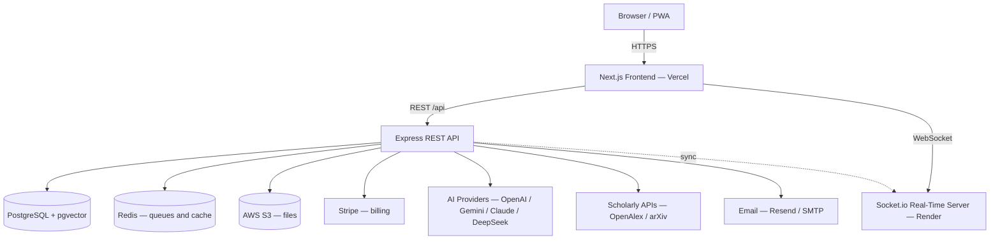
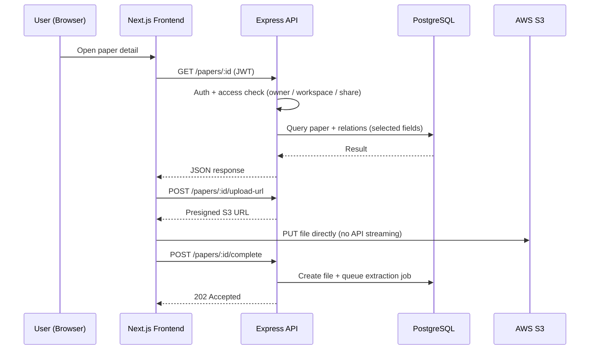

# ScholarFlow — Project Proposal

> **AI-Powered Research Paper Collaboration Platform**

| Field | Value |
| ----- | ----- |
| **Document type** | Project Proposal |
| **Project name** | ScholarFlow |
| **Document version** | 1.0 |
| **Date** | September 2026 |
| **Repository** | https://github.com/Atik203/Scholar-Flow |
| **Live demo** | Frontend: `scholar-flow-ai.vercel.app` · API: `scholar-flow-api.vercel.app/api/health` |
| **Platform type** | Cloud SaaS (multi-tenant, web) |
| **Primary audience** | Researchers, students, professors, academic teams |

---

## Document Index

### Main Sections

| # | Section | Summary |
| - | ------- | ------- |
| 1 | [Executive Summary](#1-executive-summary) | The pitch, the gap, the solution, the plan |
| 2 | [Project Overview](#2-project-overview) | Vision, mission, value propositions |
| 3 | [Background & Problem Statement](#3-background--problem-statement) | Why this project is needed |
| 4 | [Objectives & Success Criteria](#4-objectives--success-criteria) | What the project must achieve |
| 5 | [Scope](#5-scope) | In scope, out of scope, future scope |
| 6 | [Target Users & Personas](#6-target-users--personas) | Who the platform serves |
| 7 | [Benchmark & Competitor Analysis](#7-benchmark--competitor-analysis) | Market comparison and gap |
| 8 | [Proposed Solution](#8-proposed-solution) | The unified platform concept |
| 9 | [Feature Specification](#9-feature-specification) | Every planned module in detail |
| 10 | [System Architecture](#10-system-architecture) | Three-tier decoupled design |
| 11 | [Technology Stack](#11-technology-stack) | Chosen technologies and rationale |
| 12 | [Database Design](#12-database-design) | Data model, entities, vector search |
| 13 | [API Design](#13-api-design) | REST, SSE and WebSocket interfaces |
| 14 | [Security & Compliance](#14-security--compliance) | Auth, RBAC, data protection |
| 15 | [Performance & Scalability](#15-performance--scalability) | Query budgets, caching, growth path |
| 16 | [Quality Assurance](#16-quality-assurance) | Gates, reviews, verification workflow |
| 17 | [Deployment & DevOps](#17-deployment--devops) | Environments, hosting, CI/CD |
| 18 | [Development Roadmap](#18-development-roadmap) | Phased plan and timeline |
| 19 | [Risk Analysis & Mitigation](#19-risk-analysis--mitigation) | Risks and countermeasures |
| 20 | [Cost & Budget](#20-cost--budget) | Infrastructure, services, AI costs |
| 21 | [Success Metrics](#21-success-metrics) | Measurable targets |
| 22 | [Conclusion & Future Work](#22-conclusion--future-work) | Closing and next steps |
| 23 | [Appendices](#23-appendices) | Commands, env vars, glossary |

### Section 9 — Feature Specification (Sub-Index)

| # | Feature Area | # | Feature Area |
| - | ------------ | - | ------------ |
| 9.1 | [Authentication and Onboarding](#91-authentication-and-onboarding) | 9.14 | [Notes and Notebooks](#914-notes-and-notebooks) |
| 9.2 | [Dashboard and Navigation Shell](#92-dashboard-and-navigation-shell) | 9.15 | [PDF Annotations](#915-pdf-annotations) |
| 9.3 | [Paper Management](#93-paper-management) | 9.16 | [AI Assistant](#916-ai-assistant) |
| 9.4 | [PDF Text Extraction and Processing](#94-pdf-text-extraction-and-processing) | 9.17 | [AI Paper Tools](#917-ai-paper-tools) |
| 9.5 | [Rich Text Editor](#95-rich-text-editor) | 9.18 | [AI Writing Tools](#918-ai-writing-tools) |
| 9.6 | [Collections](#96-collections) | 9.19 | [Semantic Search](#919-semantic-search) |
| 9.7 | [Workspaces](#97-workspaces) | 9.20 | [Discover and Research Feeds](#920-discover-and-research-feeds) |
| 9.8 | [Team Management and RBAC](#98-team-management-and-rbac) | 9.21 | [Global Search](#921-global-search) |
| 9.9 | [Invitations](#99-invitations) | 9.22 | [Analytics](#922-analytics) |
| 9.10 | [Email Sharing and Permissions](#910-email-sharing-and-permissions) | 9.23 | [Notifications](#923-notifications) |
| 9.11 | [Citations and Citation Graph](#911-citations-and-citation-graph) | 9.24 | [Real-Time Collaboration](#924-real-time-collaboration) |
| 9.12 | [Research Map](#912-research-map) | 9.25 | [Billing and Subscriptions](#925-billing-and-subscriptions) |
| 9.13 | [Discussions](#913-discussions) | 9.26 | [Admin Console](#926-admin-console) |
| | | 9.27 | [Public and Marketing Pages](#927-public-and-marketing-pages) |

---

## 1. Executive Summary

ScholarFlow is a cloud-based, AI-powered research paper collaboration platform
that unifies the entire academic research workflow in one place: uploading and
organizing papers, reading and annotating them, writing new papers, generating
citations, collaborating with teams in real time, and managing it all through a
role-based workspace model.

Today, a typical researcher uses four or more disconnected tools — a reference
manager, a PDF reader, a note-taking app, a word processor, and a citation
generator — and still receives almost no artificial-intelligence assistance.
Existing commercial tools are either expensive, closed to teams, or weak in AI.
ScholarFlow addresses this gap with a single, affordable platform that combines
reference management, AI analysis, collaborative writing, and team workspaces.

The platform is proposed as a multi-tenant SaaS product with the following
pillars:

- **Research management** — paper upload with automatic AI metadata extraction,
  DOI/arXiv/URL import, PDF text extraction, full-text and semantic search,
  collections, and tags.
- **AI assistance** — a floating AI assistant, paper summarization, key-point
  extraction, question answering, rewriting, comparison, translation,
  literature review generation, and automatic metadata — powered by multiple
  providers (OpenAI, Google Gemini, Anthropic Claude, DeepSeek) with automatic
  fallback.
- **Academic writing** — a rich text editor with LaTeX math, seven paper
  templates, image handling, version history, auto-save, PDF/DOCX/Markdown
  export, and citation insertion.
- **Collaboration** — workspaces with role-based access, team invitations,
  email-based paper sharing with view/edit permissions, discussions, and
  real-time co-editing with live cursors and presence.
- **Monetization** — subscription plans (Free, Pro, Team) through Stripe with
  hosted checkout, customer portal, webhook-driven entitlement updates, and a
  grace-period downgrade policy.
- **Administration** — a complete admin console for user, subscription, plan,
  payment, report, audit, webhook, moderation, and system-health management.

The project will be delivered as a TypeScript monorepo: a Next.js frontend, an
Express REST API, and a dedicated WebSocket server, backed by PostgreSQL with
the pgvector extension, AWS S3 for file storage, Redis for background jobs, and
Stripe for billing. The delivery plan spans six phases over approximately eight
to eleven weeks.

The remainder of this document specifies the problem, objectives, scope,
complete feature set, architecture, data model, security posture, delivery
plan, budget, and success metrics for the project.

---

## 2. Project Overview

### 2.1 Project Identity

| Field | Description |
| ----- | ----------- |
| **Name** | ScholarFlow |
| **Category** | Academic research SaaS (AI + collaboration) |
| **Form factor** | Responsive web application (desktop-first, mobile-capable) |
| **Users** | Students, researchers, professors, academic teams, institutions |
| **Business model** | Freemium subscription (Free / Pro / Team), monthly and annual |
| **Core differentiator** | Reference management + AI + real-time collaboration in one affordable platform |

### 2.2 Vision

To become the single workspace where academic research is discovered, read,
written, cited, and shared — with AI that accelerates every step instead of
interrupting it.

### 2.3 Mission

To remove the tool-switching, cost, and collaboration barriers that slow
researchers down, by providing an affordable, AI-native platform that covers
the complete paper lifecycle: **upload → organize → read → annotate → write →
cite → collaborate → publish**.

### 2.4 Core Value Propositions

1. **One platform instead of four or more tools.** Papers, annotations, notes,
   writing, citations, and collaboration live together, so context is never
   lost between applications.
2. **AI woven into every workflow.** Summaries, key points, Q&A, rewriting,
   comparison, translation, and literature reviews are available in context —
   not in a separate chatbot.
3. **Real-time teamwork.** Workspaces, role-based permissions, live discussions,
   and simultaneous co-editing with cursor presence.
4. **Student-friendly pricing.** A genuinely useful free tier, with affordable
   Pro and Team plans, instead of the $50–$250/month pricing of legacy tools.
5. **Open, modern, maintainable engineering.** A fully typed TypeScript stack,
   documented APIs, migration discipline, and a clean three-tier architecture.

### 2.5 Delivery Format

The platform will be delivered as a multi-tenant cloud service:

- **Frontend application** — server-rendered web app, responsive from 375px to
  desktop, installable as a browser app.
- **REST API** — stateless JSON API with JWT authentication, consumed only by
  the frontend and authorized integrations.
- **Real-time server** — dedicated WebSocket service for presence, co-editing,
  and live discussion messages.
- **Managed data layer** — PostgreSQL with pgvector on a managed cloud
  database; S3-compatible object storage for all files.

---

## 3. Background & Problem Statement

### 3.1 The Current Research Workflow

Academic research today is fragmented across disconnected tools:

| Step | Typical tool | Problem |
| ---- | ------------ | ------- |
| Find papers | Google Scholar, publisher sites | No single library; duplicates and dead links |
| Store references | Zotero / Mendeley / EndNote | No AI; weak or paid team features |
| Read and annotate | PDF viewers, printed copies | Annotations trapped in files, not searchable |
| Take notes | Notion / Word / paper | Notes detached from papers and citations |
| Write | Word / LaTeX / Google Docs | No citation integration; no research context |
| Cite | Manual formatting | Error-prone; format switching is painful |
| Collaborate | Email attachments, chat apps | Version chaos; no permissions; no real-time editing |

A researcher switches between these tools dozens of times per day, and each
switch costs context, time, and accuracy.

### 3.2 Core Problems

**Problem 1 — Fragmentation.** There is no single place for papers, notes,
citations, and writing. Users maintain the same information in multiple tools
and lose hours every week reconciling it.

**Problem 2 — No meaningful AI assistance.** The overwhelming majority of
researchers still read, summarize, and compare papers manually. Legacy
reference managers offer no AI at all; AI writing tools offer no reference
management. Nothing combines both.

**Problem 3 — Collaboration is an afterthought.** Team features in existing
tools are limited to shared folders with weak permissions. Real-time co-editing
of a paper, live discussions, and fine-grained sharing (view vs. edit per
person) are effectively absent.

**Problem 4 — Cost.** Professional tools range from roughly $50 to $250 per
user per month. Students and small research groups cannot justify this,
especially when no single tool covers the whole workflow.

### 3.3 Market Gap

The market contains strong single-purpose tools but no unified product:

- Reference managers (Zotero, Mendeley, EndNote) — organize references, but
  little to no AI, and weak collaboration.
- AI writing assistants (Paperpal and similar) — improve text, but manage no
  references and no library.
- General AI chatbots — powerful, but disconnected from the user's actual
  papers, citations, and workspace context.

The gap is a single platform that combines **library management + AI analysis +
academic writing + real-time collaboration**, priced for students.

### 3.4 Motivation

The project is motivated by first-hand experience of these problems in
academic work:

- Tool-switching consumes three or more hours every week for an active
  researcher.
- Most researchers receive no AI help at all in their reading and synthesis
  work.
- Existing tooling prices exclude the students who need it most.
- Collaboration in student and research teams is still done through email
  attachments and chat messages.

ScholarFlow is proposed to close this gap with one unified, affordable,
AI-native platform.

### 3.5 Why Now

- Large language models have reached the quality and cost point where
  summarization, Q&A, and synthesis are practical for everyday academic use.
- Vector databases (pgvector) make semantic search over a personal library
  feasible without dedicated infrastructure.
- Modern web frameworks make real-time, collaborative, server-rendered
  applications achievable by small teams.
- Cloud pricing for managed Postgres, object storage, and serverless hosting
  allows a freemium model to be sustainable from day one.

---

## 4. Objectives & Success Criteria

### 4.1 Primary Objectives

1. **Unify the research workflow** — deliver one platform covering upload,
   organization, reading, annotation, writing, citation, and collaboration.
2. **Make AI a first-class capability** — provide summarization, key points,
   Q&A, rewriting, comparison, translation, and literature review directly in
   the research context, with multi-provider reliability.
3. **Enable real teamwork** — workspaces with roles, invitations, granular
   sharing, discussions, and real-time co-editing with presence.
4. **Remove the cost barrier** — offer a useful free tier and affordable Pro
   and Team subscriptions with transparent pricing.
5. **Ship production-grade engineering** — a fully typed monorepo, documented
   REST API, migration discipline, security hardening, and measurable
   performance budgets.

### 4.2 Secondary Objectives

- Automatic metadata extraction so that uploading a paper requires zero manual
  data entry.
- Semantic search across the entire library, not just keyword matching.
- An administrative console that gives operators full visibility and control
  over users, subscriptions, payments, content, and system health.
- An export story with no lock-in: PDF, DOCX, Markdown, BibTeX and standard
  citation formats.
- Accessibility and responsiveness as acceptance criteria, not afterthoughts.

### 4.3 Measurable Success Criteria

| Area | Criterion | Target |
| ---- | --------- | ------ |
| Workflow coverage | Lifecycle steps covered by one platform | 8 of 8 (upload → publish) |
| AI coverage | AI actions available in context | 10+ tools across papers, notes, chat |
| Performance | API query time (server-side, p95) | < 50 ms per query event |
| Performance | Page interaction (LCP on dashboard) | < 2.5 s on standard broadband |
| Reliability | API availability target | 99.9% monthly |
| Quality | Lint / type-check / build gates | 0 errors on every merge |
| Accessibility | New UI components | WCAG 2.1 AA |
| Business | Free → paid conversion (12 months post-launch) | ≥ 5% |
| Business | Monthly churn (paid plans) | < 5% |
| Cost | AI cost per active user per month | < $0.50 average |

---

## 5. Scope

### 5.1 In Scope

The following capabilities are within the project scope:

**Research core**

- Paper upload (drag-and-drop, multi-file) with S3 storage.
- Import by DOI, arXiv ID, URL, BibTeX/RIS, and reference-manager exports
  (Zotero, Mendeley, EndNote).
- AI metadata extraction (title, authors, abstract, year, venue, tags).
- PDF text extraction pipeline with status tracking and a text viewer.
- Full-text search with filters; semantic (vector) search over paper content.
- Collections with visibility, permissions, status, and starring.
- PDF preview in a secure viewer.

**Writing and citations**

- Rich text editor with formatting, tables, lists, images, and LaTeX math.
- Seven paper templates (IEEE, ACM, Springer, arXiv, thesis, literature
  review, blank).
- Auto-save with debounce, draft/publish states, version history (50
  snapshots), word count and reading time.
- Export to PDF, DOCX, and Markdown.
- Nine citation formats (APA, MLA, IEEE, Chicago, Harvard, Vancouver, ACS,
  BibTeX, EndNote), export history, and a citation graph.
- Research Map: topic cloud generated from library tags.

**Collaboration**

- Workspaces with roles (Owner, Manager, Editor, Viewer) and settings.
- Team management: members, roles, activity log, invitations, removal.
- Email-based paper sharing with view/edit permissions and revocation.
- Discussions (threaded, pin/resolve) and live discussion chat.
- Real-time co-editing (Y.js) with cursor presence and typing indicators.
- Notifications: real-time SSE delivery, categories, quiet hours, bell UI.

**AI**

- Floating global AI assistant (multi-provider, conversation history).
- Paper summarizer, key points, Q&A insight threads, comparator, translator,
  literature review, rewriter.
- Context-aware chat that knows the current paper/workspace.
- Semantic search powered by embeddings.

**Discovery and insight**

- Discover: trending papers, personalized recommendations, category explorer
  from live scholarly APIs.
- Global search across papers and (admin-only) people.
- Analytics: personal, workspace, and usage dashboards with CSV/JSON export.
- Activity log with filters and export.

**Monetization and administration**

- Stripe Checkout, Customer Portal, webhook-driven subscriptions, grace-period
  downgrade sweeper.
- Plans and pricing management; payments and subscriber views.
- Full admin console: users, subscriptions, plans, payments, reports, audit
  log, AI models and keys, API keys, webhooks, moderation, alerts, system
  health, platform settings.

**Platform**

- Authentication: Google OAuth, GitHub OAuth, email/password, email
  verification, password reset.
- Marketing site: product, resources, company, enterprise, legal pages.
- Public paper view with permission-aware access.

### 5.2 Out of Scope (Initial Release)

- Native mobile applications (the web app is responsive; native apps are
  deferred).
- Enterprise SSO/SAML integration (Okta, Azure AD) — planned as future work.
- Institution-level billing and seat management.
- Offline-first editing.
- Self-hosted/on-premise distribution.
- Non-English UI localization (content translation via AI is in scope; UI
  localization is not).

### 5.3 Future Scope

- SSO/SAML and enterprise license management.
- Custom branding per workspace and IP allow-listing.
- Advanced plan-tier rate limiting and usage-based AI credits.
- AI research-gap analysis and trend detection across collections.
- Public API for third-party integrations and a plugin ecosystem.

---

## 6. Target Users & Personas

### 6.1 Primary Personas

| Persona | Description | Key needs | How ScholarFlow serves them |
| ------- | ----------- | --------- | --------------------------- |
| **The Student Researcher** | Undergraduate/graduate writing a thesis or paper | Affordable, simple, fast literature help | Free tier; AI summaries and Q&A; citations; templates |
| **The Active Researcher** | Postdoc/faculty reading and writing continuously | Deep library management, synthesis at scale | Semantic search; collections; key points; literature review; citation graph |
| **The Professor / Supervisor** | Guides multiple students and projects | Oversight, shared spaces, low admin overhead | Team workspaces; roles; activity log; analytics |
| **The Research Team Member** | Collaborator on a shared paper | Co-editing, comments, permissions | Real-time co-editing; email sharing with view/edit; discussions |
| **The Team Lead** | Owns a workspace and its members | Control over access and billing | Team management; invitations; plan management; billing portal |
| **The Platform Administrator** | Operates the SaaS | Visibility, control, safety | Admin console: users, payments, reports, audit, system health |

### 6.2 User Journeys (Representative)

**Journey A — From PDF to understanding (student):**
Upload a PDF → AI extracts title/authors/abstract → AI summary and key points →
ask follow-up questions in the paper chat → save annotations and notes.

**Journey B — From library to literature review (researcher):**
Build a collection → semantic search across the library → compare selected
papers → generate a literature-review draft → insert citations while writing.

**Journey C — From draft to shared paper (team):**
Create a paper from a template → invite co-authors to the workspace → co-edit
in real time with cursors → share a read-only link externally → export to PDF.

**Journey D — From signup to paid team (lead):**
Register → create a workspace → invite the team → upgrade to the Team plan via
Stripe Checkout → manage seats and billing in the Customer Portal.

---

## 7. Benchmark & Competitor Analysis

### 7.1 Comparison Matrix

Legend: ✅ full support · ◐ partial / limited · ❌ not available

| # | Capability | ScholarFlow (proposed) | Paperpal | EndNote | Mendeley | Zotero |
| - | ---------- | ---------------------- | -------- | ------- | -------- | ------ |
| 1 | Reference/library management | ✅ | ❌ | ✅ | ✅ | ✅ |
| 2 | PDF reading and annotation | ✅ | ❌ | ◐ | ✅ | ◐ |
| 3 | AI summarization | ✅ | ◐ | ❌ | ❌ | ❌ |
| 4 | AI Q&A over papers | ✅ | ❌ | ❌ | ❌ | ❌ |
| 5 | AI writing assistance | ✅ | ✅ | ❌ | ❌ | ❌ |
| 6 | Semantic (meaning) search | ✅ | ❌ | ❌ | ❌ | ❌ |
| 7 | Rich text editor with citations | ✅ | ◐ | ❌ | ❌ | ◐ |
| 8 | Real-time co-editing | ✅ | ❌ | ❌ | ❌ | ❌ |
| 9 | Team workspaces with roles | ✅ | ◐ | ◐ | ◐ | ◐ |
| 10 | Citation generation (9 formats) | ✅ | ◐ | ✅ | ✅ | ✅ |
| 11 | Built-in billing / plans | ✅ | ✅ | ✅ | ✅ | ◐ |
| 12 | Free tier for students | ✅ | ◐ | ❌ | ✅ | ✅ |

### 7.2 Observations

- **Reference managers** are strong on organization but offer essentially no
  AI and weak real-time collaboration.
- **AI writing tools** improve prose but do not manage references, libraries,
  or citations.
- **Free tools** (Mendeley, Zotero) cover organization well but provide no AI
  analysis, no co-editing, and limited team permissions.
- **Pricing:** professional tiers of legacy tools range from roughly $50 to
  $250 per user per month; most students cannot justify this.

### 7.3 Positioning

ScholarFlow targets the intersection that no existing product occupies:
**library + AI + academic writing + real-time collaboration**, at
student-friendly pricing. The proposed platform is not a feature-for-feature
clone of any competitor; it is a workflow consolidation product.

---

## 8. Proposed Solution

### 8.1 The Unified Platform

ScholarFlow proposes a single web platform where a researcher can complete the
entire paper lifecycle without leaving the application:

```
Find  →  Save  →  Read  →  Annotate  →  Write  →  Cite  →  Collaborate  →  Publish
 │        │        │          │           │        │            │             │
Discover  Library  PDF     Highlights  Editor   Citations   Workspaces   Export/Share
feeds    +tags    viewer   +notes      +LaTeX   +graph      +realtime    +public view
```

### 8.2 Module Map

The platform is organized into functional modules, each specified in
Section 9:

1. **Identity** — authentication, onboarding, profile, security settings.
2. **Research Library** — papers, extraction, search, collections, discover.
3. **Reading** — PDF preview, annotations, notes, notebooks.
4. **Writing** — rich text editor, templates, LaTeX, versions, exports.
5. **References** — citations, formats, bibliography, citation graph.
6. **Intelligence** — AI assistant, paper tools, writing tools, semantic
   search.
7. **Collaboration** — workspaces, teams, invitations, sharing, discussions,
   real-time co-editing, notifications.
8. **Insight** — analytics, activity logs, reports.
9. **Business** — plans, subscriptions, payments, billing portal.
10. **Operations** — admin console, moderation, webhooks, system health,
    platform settings.

### 8.3 What Makes the Solution Different

1. **Contextual AI, not a detached chatbot.** The assistant and paper tools
   operate on the user's actual papers, collections, and workspace context.
2. **Multi-provider AI with automatic fallback.** OpenAI, Gemini, Claude, and
   DeepSeek are interchangeable; a provider outage degrades gracefully instead
   of breaking features.
3. **Permissions everywhere.** Every paper, collection, and workspace action is
   access-checked — including email shares and editor writes.
4. **Realtime by design.** Presence, cursors, typing indicators, and live
   discussions are part of the core, not a plugin.
5. **No lock-in.** Full export to PDF, DOCX, Markdown, BibTeX, and nine
   citation formats.
6. **Operable from day one.** Billing, entitlements, moderation, audit, and
   system health are first-class features of the product.

### 8.4 High-Level Delivery Approach

- Build a thin vertical slice first: authentication → upload → library →
  editor → sharing.
- Layer AI on top of the library (metadata → summaries → Q&A → search).
- Add collaboration (workspaces → realtime → notifications).
- Add monetization (plans → checkout → webhooks → portal).
- Complete with administration, hardening, and launch readiness.

Detailed sequencing, phases, and timelines are provided in Section 18.

---

## 9. Feature Specification

This section specifies every planned module of the platform. Each subsection
states the purpose, the functional capabilities, and the key behaviors and
rules that the implementation must honor.

### 9.1 Authentication and Onboarding

**Purpose:** Give users a secure, low-friction way to create an account and
reach their workspace quickly.

**Capabilities**

- Email/password registration with password-strength guidance.
- Google OAuth and GitHub OAuth sign-in.
- Email verification and secure password reset with time-limited tokens.
- Session management with JWT access tokens and refresh tokens.
- Onboarding flow: role selection, workspace creation, and preferences.
- Profile management: name, avatar, institution, research interests.
- Security settings: password change, active sessions, login history.
- Role model: Researcher, Pro Researcher, Team Lead, Administrator.

**Key rules**

- Passwords are hashed with bcrypt; plaintext passwords are never stored or
  logged.
- Sessions are validated server-side on every protected request.
- Auth state is persisted client-side so a page reload never logs the user out
  unexpectedly, and is flushed before any hard navigation to avoid stale state.
- OAuth profile data never overwrites user-edited names or avatars; it only
  fills empty fields.

### 9.2 Dashboard and Navigation Shell

**Purpose:** Provide a consistent, role-aware shell that surfaces the right
modules for each user.

**Capabilities**

- Dashboard home with quick actions, recent papers, and progress widgets.
- Collapsible sidebar navigation grouped by research area, with role-gated
  items.
- Command-style search entry and global AI assistant entry point (Ctrl/Cmd+J).
- Notifications bell with unread count.
- Profile menu with account, billing, and sign-out actions.
- Responsive behavior: mobile drawer navigation, tablet collapse, desktop
  full sidebar.
- Consistent page headers, empty states, error states, and loading skeletons.

**Key rules**

- Navigation items are shown or hidden based on the user's role and derived
  team access; the server remains the authority for every action.
- Every dashboard feature is reachable in at most two clicks from the
  shell.

### 9.3 Paper Management

**Purpose:** Make adding and organizing papers effortless — the entry point
of the entire workflow.

**Capabilities**

- Multi-file PDF upload with drag-and-drop and progress feedback.
- Import by DOI, arXiv identifier, URL, and reference-manager exports
  (BibTeX/RIS, Zotero, Mendeley, EndNote).
- Smart URL import that detects IEEE, ResearchGate, Google Scholar, and
  Semantic Scholar links.
- AI metadata extraction: title, authors, abstract, year, venue, and tags.
- Paper library with search, filters (author, year, tags, status), sorting,
  and pagination.
- Paper detail view: metadata, abstract, file preview, AI panels, sharing,
  version indicator.
- Draft/publish state per paper; draft papers are excluded from public and
  shared views.
- Paper relations view for related-work discovery.
- Soft deletion with safe restore windows for data protection.

**Key rules**

- Files are stored in object storage; the API issues presigned URLs and never
  streams file bodies through application memory.
- Metadata extraction failures never block upload; the paper remains editable
  manually.
- Every read and write is access-checked against ownership, workspace
  membership, and shares.

### 9.4 PDF Text Extraction and Processing

**Purpose:** Turn uploaded PDFs into searchable, AI-ready text.

**Capabilities**

- Background processing queue for extraction jobs.
- Text extraction with OCR fallback for scanned documents.
- Processing status tracking (queued, processing, done, failed) with live
  feedback in the UI.
- Extracted text storage in chunked form for search and embeddings.
- Text viewer for the extracted content.
- Automatic embedding generation for semantic search.

**Key rules**

- Extraction is asynchronous and resilient; failures are retryable.
- Chunking respects a token budget so embeddings remain within model limits.
- Embedding dimensions are fixed; the pipeline validates vector length before
  insert.

### 9.5 Rich Text Editor

**Purpose:** Provide a world-class academic writing experience inside the
platform.

**Capabilities**

- Full rich text formatting: headings, lists, quotes, tables, alignment
  (left/center/right/justify), text styles.
- LaTeX math: inline (`$...$`) and block (`$$...$$`) rendering with KaTeX.
- Seven paper templates: IEEE, ACM, Springer, arXiv, thesis, literature
  review, and blank.
- Image handling: drag-and-drop, paste, resizing, alignment, captions, and
  text wrapping — image files stored in object storage.
- Citations: search and insert from the citation manager.
- Auto-save with debounce, manual save, and explicit save-state indicator.
- Draft and publish workflow as separate states.
- Version history: automatic snapshot before saves, retention of 50 versions,
  and restore.
- Word count, character count, and reading-time display.
- Full-screen distraction-free mode.
- Export to PDF, DOCX, and Markdown.
- Editor settings: autosave delay, font size, spellcheck — persisted per
  user.
- Collaboration entry: open the paper in the real-time co-editing room.

**Key rules**

- Saving is debounced; the editor never writes on every keystroke.
- Exports are rendered server-side for consistent, professional output.
- Collaborative persistence keeps saved content durable: the shared document
  is seeded from saved content exactly once and persisted on a debounce.

### 9.6 Collections

**Purpose:** Organize papers into logical groups for projects, courses, and
literature reviews.

**Capabilities**

- Create, rename, describe, and delete collections.
- Visibility controls: private, workspace, or shared.
- Permission model per collection: view or edit.
- Add/remove papers, with per-paper status (e.g., to-read, reading, read) and
  starring.
- Collection details view with member list and activity context.
- Shared collections view for items shared with the user.
- Pagination and search within collections.

**Key rules**

- Collection membership never bypasses paper-level access checks.
- Workspace collections inherit workspace roles; personal collections remain
  private unless explicitly shared.

### 9.7 Workspaces

**Purpose:** The collaborative container for papers, collections, members,
and billing entitlements.

**Capabilities**

- Create workspaces with name, description, and visibility (private /
  discoverable).
- Workspace detail pages with tabs: overview, papers, collections, members,
  settings.
- Workspace settings: general information, default roles, and preferences.
- Workspace member management: add, change role, remove.
- Invite flow with Viewer / Editor / Manager role selection.
- Workspace-scoped analytics and activity.
- Workspace list with search, filtering, and pagination.
- Shared-with-me workspaces view.

**Key rules**

- Only the workspace owner can change workspace settings and delete the
  workspace.
- Removing a member revokes their workspace access immediately; account
  deletion remains an administrative action.
- Every workspace mutation is validated with schema checks and rate limiting.

### 9.8 Team Management and RBAC

**Purpose:** Let team leads manage their people without inflating global
roles.

**Capabilities**

- Team members list with role, real status (online/offline), and last-active
  information.
- Role changes (Lead/Manager/Editor/Viewer mapping) with immediate effect.
- Safe member removal that revokes workspace memberships and pending
  invitations owned by the lead.
- Invitations management: sent and received lists, resend, cancel,
  accept/decline.
- Team activity log: who did what, with member and date filters, severity
  labels, and cursor pagination.
- Team stats: member counts and workspace counts.
- Team settings for leads.
- Derived team access: collaborators who are active members of another user's
  workspace, or who hold pending invitations, see the Team area — without
  global role promotion.

**Key rules**

- Read access is broad (lead or active collaborator); sensitive actions
  (role change, removal, settings) require the team-lead role.
- Role checks use centralized constants and a single access helper; string
  comparisons of role names are forbidden.
- Server-side enforcement matches the UI gating exactly.

### 9.9 Invitations

**Purpose:** Make joining a team or workspace simple and trackable.

**Capabilities**

- Send invitations targeted at a specific workspace with a selected role.
- Email delivery through the transactional email service, with provider
  fallback.
- Public invitation response page: accept or decline by token.
- Invitation states: pending, accepted, declined, cancelled, expired.
- Resend and cancel actions with feedback.
- Real-time notification to the inviter when an invitation is accepted or
  declined.

**Key rules**

- Invitations are workspace-scoped and verified against workspaces owned by
  the inviter.
- Email delivery failures never block the invitation record; failures are
  logged and surfaced.
- Accepting an invitation grants exactly the invited role for exactly the
  target workspace.

### 9.10 Email Sharing and Permissions

**Purpose:** Share individual papers with people outside the workspace,
with explicit permissions.

**Capabilities**

- Share a paper by email with a chosen permission: **view** or **edit**.
- Idempotent share records: re-sharing the same paper with the same email
  re-activates the existing share.
- Permission-aware links: viewers receive the paper detail page; editors
  receive the editor route.
- "Shared with" list visible to the paper owner, with revoke action.
- Invited papers appear in the recipient's editor/library list with an
  **Invited** badge and their permission level.
- Editors can edit and save; viewers are enforced read-only.

**Key rules**

- Shares are soft-deleted on revoke; access checks treat revoked shares as
  nonexistent (403).
- Every paper access gate (detail, editor read, editor write, export,
  download) honors shares by the user's verified email.
- Revocation takes effect immediately across all surfaces.

### 9.11 Citations and Citation Graph

**Purpose:** Remove the manual labor and formatting errors from referencing
work.

**Capabilities**

- Nine citation formats: APA, MLA, IEEE, Chicago, Harvard, Vancouver, ACS,
  BibTeX, and EndNote.
- Citation manager page: search library, create citations, format switching.
- Insert citations directly from the editor toolbar.
- Persisted citation records linked to papers.
- Export history with re-download and deletion.
- Bibliography generation for exports.
- Citation graph: a visual map of real citation links between library papers.
- Pro-level format restrictions enforced server-side.

**Key rules**

- Citation inserts are access-checked against the source paper.
- Generated citations are deterministic for a given paper + format + style
  options.
- Exports produce real files (no placeholder downloads).

### 9.12 Research Map

**Purpose:** Give researchers a visual overview of their topical landscape.

**Capabilities**

- Topic cloud built automatically from library tags and metadata.
- Size/weight reflects topic frequency across the library.
- Filtering by topic to surface the associated papers.
- Quick navigation from a topic to filtered library views.
- Pro-plan feature with server-side entitlement checks.

**Key rules**

- Topic extraction is derived data; it never mutates paper metadata.
- Empty or sparse libraries degrade gracefully with guidance.

### 9.13 Discussions

**Purpose:** Keep research conversations attached to the work instead of
scattered across chat apps.

**Capabilities**

- Threaded discussions with titles, bodies, tags, and categories.
- Create, edit, and delete threads with permission checks.
- Replies with author identity and timestamps.
- Pin and resolve states for thread lifecycle.
- Live discussion feed: real-time message delivery, typing indicators, and
  presence over WebSocket.
- Discussion list with filters and pagination; discussion detail view.
- Notifications for replies and mentions, respecting user preferences.

**Key rules**

- WebSocket message sends are validated server-side; clients cannot spoof
  authorship.
- Discussion rooms are access-scoped: only workspace members and the thread
  owner can join.
- Real-time delivery degrades to refresh/polling if the socket is
  unavailable.

### 9.14 Notes and Notebooks

**Purpose:** Capture research thinking in a structured, durable way.

**Capabilities**

- Notebooks containing ordered sections; sections containing notes.
- Note types: general, summary, question, idea, reference, and meeting notes.
- Rich note editing with formatting, lists, and links.
- Note visibility controls (private / shared).
- Cross-linking notes to papers, collections, and discussions.
- Search across notes and notebooks.
- Create, edit, reorder, and delete notebooks, sections, and notes.

**Key rules**

- Deleting a note is soft where possible; ordering changes are explicit and
  persisted.
- Notes remain readable even if a referenced paper is deleted (reference
  displays as unavailable).

### 9.15 PDF Annotations

**Purpose:** Turn reading into reusable knowledge — highlights and notes
attached to the exact place in the paper.

**Capabilities**

- Highlight, underline, and strikethrough annotations on PDF text.
- Optional notes on every mark; empty notes are valid and clearable.
- Collapsible "Your Papers" panel with search and a PDF-ready filter.
- Compact icon-only annotation type picker with tooltips.
- Viewport-clamped annotation popup; edit dialog; confirmed deletes.
- Annotation versions for auditability.
- Mobile-friendly annotations (drawer layout on small screens).
- Per-annotation color and type; filtering by type.
- Annotation counts reflected in analytics.

**Key rules**

- Annotations are access-scoped to the paper; users only see their
  annotations or those shared with them per permissions.
- Queries retry on transient failure so reading sessions never lose marks.
- Deletion requires confirmation and is reflected immediately.

### 9.16 AI Assistant

**Purpose:** A context-aware assistant available everywhere in the product.

**Capabilities**

- Floating global assistant accessible from any page (Ctrl/Cmd+J).
- Markdown answers with syntax-highlighted code blocks and copy-to-clipboard.
- Conversation history persisted per user, organized by conversations.
- Model selector populated dynamically from provider availability.
- Context awareness: the assistant knows the current paper, collection, or
  workspace being viewed.
- "Ask about this paper" entry points on paper views.
- Streaming responses for fast perceived latency, with non-streaming
  fallback.
- Token-efficiency measures: context caching and bounded history windows.

**Key rules**

- Provider fallback order is configurable; a failing provider retries down
  the chain before surfacing an error.
- AI-generated rich content is sanitized and HTML-escaped before rendering.
- Conversations are private to their owner.

### 9.17 AI Paper Tools

**Purpose:** Analyze individual papers and groups of papers on demand.

**Capabilities**

- **Summarizer** — tone/audience/length-configurable paper summaries, cached
  per configuration.
- **Key Points** — extraction of the paper's main claims and findings,
  persisted for reuse.
- **Insight Threads (Q&A)** — ask natural-language questions about a paper,
  with answers grounded in extracted text.
- **Comparator** — side-by-side comparison of two or more papers, surfacing
  agreements, disagreements, and method differences.
- **Literature Review** — synthesis draft generated from a collection or a
  selected set of papers.
- **Translator** — translate abstracts and sections into other languages.
- **Metadata generation** — title/author/abstract/tag suggestions on upload
  and edit.

**Key rules**

- Every tool verifies access to each referenced paper before processing
  (owner or workspace member); unauthorized requests receive 403.
- Outputs are cached where re-computation is wasteful, with explicit
  invalidation on paper edit.
- AI costs are tracked per usage event for analytics and budgeting.

### 9.18 AI Writing Tools

**Purpose:** Improve the quality and speed of academic writing inside the
editor.

**Capabilities**

- **Rewriter** — improve clarity, fix grammar, adjust academic tone and
  length.
- Section drafting assistance from outlines and referenced papers.
- Abstract and title suggestions grounded in the paper's own content.
- Inline suggestions applied to the editor with explicit user confirmation.
- Tool history per paper for traceability.

**Key rules**

- Rewrites never overwrite user text without confirmation.
- Prompts are bounded to the selected content plus minimal necessary
  context.

### 9.19 Semantic Search

**Purpose:** Search the library by meaning, not just keywords.

**Capabilities**

- Vector embeddings for paper content chunks.
- Similarity search across all accessible papers.
- Hybrid behavior: keyword results merged with semantic matches.
- Access-scoped results: owner or workspace membership only.
- Relevance-ranked results with source paper context.
- Embedding regeneration when paper text changes.

**Key rules**

- Similarity queries use cosine distance over indexed vectors with a bounded
  result limit.
- Vector columns and indexes are treated as production data: never dropped,
  never resized in place.
- Raw SQL is used only where the ORM cannot express vector operations, always
  parameterized.

### 9.20 Discover and Research Feeds

**Purpose:** Bring relevant new research into the platform automatically.

**Capabilities**

- **Trending** — current papers from public scholarly sources (e.g., OpenAlex,
  arXiv) ranked by citations and recency, merged with platform papers.
- **For You** — personalized recommendations derived from the user's tags and
  interests, each labeled with the reason ("Because you work on X").
- **Explore** — browse submissions by curated categories with pagination.
- **Latest Research** strip on the Discover landing page.
- Save to Library: import an external paper directly from a feed card.
- External cards show source, citations, and a link to the original.

**Key rules**

- External API calls are time-limited and TTL-cached; upstream failures
  degrade to platform data instead of errors.
- Feed requests require authentication and are scoped to accessible items.
- Category inputs are validated against an allow-list.

### 9.21 Global Search

**Purpose:** One search box that finds anything the user is allowed to see.

**Capabilities**

- Unified search across papers, collections, workspaces, and notes.
- Full-text search with filters (author, year, tags, type) and ranking.
- People search for administrators, scoped to the requester's team members.
- Search history with re-run and clear.
- Trending searches for discovery.

**Key rules**

- Paper results are filtered to the user's own papers or workspaces where the
  user is an owner or active member.
- Non-admin users receive empty people results rather than an error, so
  unified search never fails as a whole.
- Search endpoints are rate-limited and paginated.

### 9.22 Analytics

**Purpose:** Make activity visible and measurable for individuals, teams,
and operators.

**Capabilities**

- **Personal analytics** — reading time, papers read, uploads, annotations,
  writing activity over time.
- **Workspace analytics** — member contributions, paper growth, collection
  activity.
- **Usage analytics** — feature usage events and trends.
- **Exports** — CSV/JSON downloads with date ranges.
- Reading session tracking (start/stop with duration) and view deduplication
  (one count per user per paper per day).
- Activity log: filterable, exportable, with severity levels.

**Key rules**

- Analytics respect access scopes: users see only their own or their
  workspace's data; administrators see platform aggregates.
- Usage events are write-only from trusted server paths — never spoofable by
  clients.
- Exports are streamed and capped to protect the database.

### 9.23 Notifications

**Purpose:** Deliver the right events at the right time, without noise.

**Capabilities**

- Real-time push via Server-Sent Events (SSE) with automatic reconnect and
  polling fallback.
- Notification bell with unread count and popover list.
- Notification center: full list with filters (unread, starred, category).
- Actions: mark as read, mark all as read, star/unstar, delete, bulk delete.
- Categories: papers, discussions, collections, workspace, team, billing,
  security, system, and achievements.
- Settings: channel toggles, per-category preferences, and quiet hours —
  persisted per user.
- Event coverage: invitations sent/resent/cancelled/declined, role changes,
  team removals, email shares, discussion replies, system events.

**Key rules**

- Delivery preferences are enforced at creation time; muted categories create
  no rows.
- Billing and security notifications are transactional and always delivered.
- Mutations are optimistic in the UI with rollback on failure.
- A notification can never leak existence of content the user cannot access.

### 9.24 Real-Time Collaboration

**Purpose:** Let multiple researchers work on the same paper as if they were
in the same room.

**Capabilities**

- Dedicated WebSocket server with JWT authentication on the handshake.
- Room-based channels scoped per paper, per discussion, and per workspace.
- Collaborative editing with Y.js document synchronization.
- Live cursor presence with user names and colors.
- Participant presence (who is online in the room) with clean offline
  handling.
- Typing indicators in discussions.
- Late-joiner synchronization: new participants receive the current document
  state and awareness of existing peers.
- Permission-aware participation: read-only members join as observers.
- Debounced persistence of collaborative edits back to saved paper content.

**Key rules**

- The socket handshake verifies the same user identity as the REST API.
- Rooms enforce membership on join; unsolicited broadcasts are rejected.
- Awareness state is cleaned up on disconnect so stale cursors disappear.
- If the socket service is unavailable, the editor remains usable with
  REST-based saving.

### 9.25 Billing and Subscriptions

**Purpose:** Monetize the platform reliably, with entitlements that can never
be faked by the client.

**Capabilities**

- Public plan catalog: Free, Pro, Team with monthly and annual pricing and
  feature comparison.
- Stripe Checkout for upgrades and plan changes, driven by the public price
  catalog (prices are data, not hardcoded).
- Customer Portal for payment method updates, invoice downloads,
  cancellation, and reactivation.
- Billing page: current plan, subscription status, renewal date, payment
  method, and invoice history.
- Self-serve cancellation with end-of-period behavior.
- Webhook processing for subscription lifecycle events, with signature
  verification and idempotent event handling.
- Grace-period sweeper: a scheduled job that downgrades accounts after a
  configurable grace window following failed payment, independent of webhook
  timing.
- Entitlement mapping: plans determine feature access and roles, updated only
  by the billing backend.

**Key rules**

- Webhooks are the only source of truth for subscription status; the frontend
  can never change a plan or role.
- Webhook handlers are idempotent and safe to replay; duplicate events cause
  no duplicate effects.
- Test and live mode credentials are strictly separated.
- Customers always retain access until the end of a paid period, subject to
  the grace policy.

### 9.26 Admin Console

**Purpose:** Full operational control of the platform, backed entirely by
real data and real actions.

**Capabilities**

| Area | Capabilities |
| ---- | ------------ |
| **Overview** | Live platform metrics, user growth, role distribution, quick actions, exports |
| **Users** | Search, inspect, change role, deactivate, delete, CSV export |
| **Subscriptions** | Subscription states, renewals, plan mapping |
| **Subscribers** | Subscriber directory with history and status |
| **Plans** | Manage the plan catalog (names, prices, features, Stripe price IDs) |
| **Payments** | Payment records, status, filters, and full-filter revenue summary |
| **Reports** | Generate, download (CSV/JSON), paginate, and track reports |
| **Audit Log** | Complete audit trail with filters and CSV/JSON export |
| **AI Models** | Model catalog, default model selection, enable/disable |
| **AI Provider Keys** | Manage provider API keys and availability |
| **API Keys** | Platform API key issuance, rotation, and revocation |
| **Webhooks** | Outbound endpoints, event subscriptions, delivery logs, retries |
| **Moderation** | Review, resolve, and dismiss content reports |
| **Alerts** | System alert rules and alert history |
| **System Health** | CPU, memory, storage, database metrics with health thresholds |
| **Diagnostics** | Database ping, pool state, memory, cache, runtime checks |
| **Logs** | In-memory application log viewer and export |
| **Platform Settings** | Persisted settings (name, support email, session timeout, 2FA policy, quotas) with audit trail |

**Key rules**

- Every admin route enforces the administrator role at the middleware level;
  there are no exceptions.
- System actions are real: cache clearing is namespaced, diagnostics execute
  genuine checks, and exports generate real files.
- Settings writes are validated and audited.
- The admin panel is code-split so it never burdens regular users' bundles.

### 9.27 Public and Marketing Pages

**Purpose:** Explain the product, build trust, and support acquisition.

**Capabilities**

- Landing page with product narrative, features, and calls to action.
- Product pages (papers, AI insights, collaborate, collections).
- Pricing page driven by the live plan catalog.
- Resources: documentation, tutorials, API reference, community.
- Company pages: about, careers, contact, press.
- Enterprise pages: teams, integrations, support.
- Legal: privacy, terms, cookies; FAQ and testimonials from managed content.
- Public paper view for published, publicly shared papers, with a friendly
  not-found experience and permission-aware rendering.
- Newsletter subscription and contact forms persisted server-side.

**Key rules**

- Marketing content is manageable without a deploy where practical (FAQ,
  testimonials, page content).
- Public paper views never expose drafts or private papers; access is
  re-verified on every request (no stale caching of denials).
- SEO fundamentals: metadata, canonical URLs, sitemap, robots.

---

## 10. System Architecture

### 10.1 Architectural Principles

1. **Decoupled tiers.** The frontend and backend share no code and communicate
   exclusively through a documented REST API. The real-time server is a
   separate deployable service.
2. **Type-safe end to end.** A single TypeScript language across all three
   applications, with a generated database client and schema validation at
   every boundary.
3. **Cloud-native.** Managed database, managed object storage, managed
   hosting — no servers to patch.
4. **Security by default.** Authentication on every protected route,
   role-based authorization, signed webhooks, presigned file URLs, and
   validated inputs.
5. **Observability built in.** Health endpoints, performance headers,
   slow-query logging, activity and audit trails.

### 10.2 High-Level Architecture



### 10.3 Frontend Architecture

- **Framework:** Next.js App Router with server components by default and
  client components only where interactivity requires them.
- **Route organization:** dashboard route groups separate the application
  shell, feature modules, and admin surfaces; marketing routes are public.
- **State management:** Redux Toolkit Query owns all server state — every API
  call flows through typed slices with cache tags; components never call
  `fetch` directly.
- **Auth integration:** better-auth manages sessions with OAuth and
  credentials; the API access token is persisted in state and attached to
  every request by a central header hook.
- **Editor:** TipTap with custom nodes for LaTeX, citations, and images; Y.js
  powers co-editing through the socket server.
- **UI system:** Tailwind CSS with a ShadCN-style component library, an OKLCH
  color system, and shared layout primitives (page headers, stat cards,
  tables, empty/error states).
- **Performance:** route-level code splitting with Suspense boundaries,
  React Compiler memoization (no manual memo hooks), optimized images, and
  streaming for large pages.

### 10.4 Backend Architecture

The backend is organized into feature modules under a single application
root. Each module follows the same internal shape:

```
module/
├── <module>.routes.ts        # route definitions + middleware chains
├── <module>.controller.ts    # thin HTTP handlers (parse → call → respond)
├── <module>.service.ts       # business logic, transactions, access checks
└── <module>.validation.ts    # Zod schemas for body / params / query
```

Planned modules (30):

| Group | Modules |
| ----- | ------- |
| **Identity** | Auth, User, Security, Invitation |
| **Research** | papers, Import, Collection, Search, Recommendation, annotations |
| **Writing** | CitationExport, Notebook, notes, Discussion |
| **Intelligence** | AI, AIChat, AIContext, AIProvider, Analytics |
| **Collaboration** | Workspace, Team, Notification, WebSocket |
| **Business** | Billing, Admin, Reports, AuditLog, Webhooks, Public, ActivityLog |

Cross-cutting middleware: authentication, role/team-access enforcement,
request validation, rate limiting, performance monitoring, error handling,
and audit logging.

### 10.5 Real-Time Server

- Standalone socket.io service, deployed separately, with no direct database
  access — it relays and manages presence only.
- JWT verification on the connection handshake, using the same secret and
  identity model as the REST API.
- Room model: `paper:<id>` for co-editing, `discussion:<id>` for live chat,
  `workspace:<id>` for presence.
- Event families: join/leave, presence, awareness/cursor updates, document
  updates, sync request/response, typing indicators, and discussion messages.
- Reliability behaviors: state synchronization for late joiners, awareness
  cleanup on disconnect, and room-membership guards on every broadcast.

### 10.6 Data Layer

- **PostgreSQL** (managed cloud) is the single source of truth, with the
  pgvector extension for embeddings.
- **Prisma ORM** with a driver adapter for pooled TCP connections; a global
  singleton prevents connection leaks in development.
- **Redis** provides the background job queue (document processing) and a
  cache layer with an in-memory fallback.
- **AWS S3** stores all binary assets — paper PDFs, editor images, and
  exports — accessed only through presigned URLs.
- **Migration discipline:** additive migrations only, applied before client
  generation, with vector columns and indexes treated as protected data.

### 10.7 Request Lifecycle (Representative)



---

## 11. Technology Stack

### 11.1 Frontend

| Technology | Version | Role | Rationale |
| ---------- | ------- | ---- | --------- |
| Next.js | 16 (App Router, Turbopack) | Framework | Server rendering, routing, streaming, image/font optimization, production-proven |
| React | 19.2 + Compiler | UI runtime | Modern concurrent features; compiler-driven memoization removes manual tuning |
| TypeScript | 5.x (strict) | Language | End-to-end type safety; refactoring confidence |
| Tailwind CSS | 4.x | Styling | Utility-first speed with a consistent design system |
| ShadCN-style components | — | UI kit | Accessible primitives owned in-repo, no vendor lock-in |
| Redux Toolkit Query | 2.x | Server state | One caching model for all API data; tag-based invalidation |
| React Hook Form + Zod | — | Forms | Performant forms with schema validation shared in spirit with the API |
| TipTap | 3.x | Editor | Extensible rich text with custom nodes (LaTeX, citations, images) |
| Y.js | 13.x | Co-editing | Conflict-free replicated documents with awareness support |
| KaTeX | — | Math rendering | Fast, high-quality LaTeX rendering in the browser |
| react-window | — | Virtualization | Keeps long lists fast |
| better-auth | — | Sessions | First-class OAuth + credentials support in the App Router |

### 11.2 Backend

| Technology | Version | Role | Rationale |
| ---------- | ------- | ---- | --------- |
| Node.js | 22+ | Runtime | LTS performance; native fetch; modern ESM support |
| Express.js | 5.x | HTTP framework | Minimal, battle-tested, ideal for a module-per-feature API |
| TypeScript | 5.x (strict) | Language | Same type discipline as the frontend |
| Prisma ORM | 7.x | Database client | Typed queries, migrations, generated SQL helpers |
| PostgreSQL | 15+ | Database | Relational integrity + pgvector in one engine |
| pgvector | 0.7+ | Vector search | Semantic search without a separate vector database |
| Zod | — | Validation | Single validation approach for body/params/query |
| JWT + bcrypt | — | Auth | Stateless access tokens; industry-standard password hashing |
| Stripe SDK | 19.x | Billing | Checkout, portal, webhooks |
| socket.io | 4.x | Real-time | Rooms, reconnection, and wide client support |
| Redis + Bull | 4.x | Queues/cache | Background PDF processing and cache layer |

### 11.3 Infrastructure & Services

| Service | Role | Rationale |
| ------- | ---- | --------- |
| Vercel | Frontend hosting + API deployment option | Edge network, previews, zero-ops |
| Render | Real-time server hosting | Long-lived WebSocket process, simple container deploys |
| Managed PostgreSQL (Prisma Cloud) | Primary database | One shared cloud database for all environments, automated backups |
| AWS S3 | Object storage | Durable, presigned-URL access, CDN-friendly |
| Stripe | Payments | Hosted checkout/portal reduce PCI scope |
| Resend / SMTP | Transactional email | Provider fallback keeps local development working |
| OpenAlex / arXiv | Scholarly data | Keyless, open APIs for discovery feeds |
| GitHub + Actions | Source control + CI | Lint, type-check, and build gates on every change |

### 11.4 Monorepo Tooling

- **Turborepo** orchestrates tasks (dev, build, lint, type-check) across the
  three applications with remote-cache-friendly task graphs.
- **Yarn Berry (v4)** provides deterministic installs and workspaces.
- **ESLint (flat configs)** enforces code quality in both applications,
  including accessibility rules on the frontend.
- **Prettier** standardizes formatting.

---

## 12. Database Design

### 12.1 Design Principles

- **Relational first.** Strong foreign keys and constraints; JSON columns only
  for genuinely schemaless data (editor metadata, template configuration).
- **Explicit selects.** List queries select only needed fields; binary and
  vector data never appear in list views.
- **Additive migrations.** Schema changes are forward-only and compatible;
  destructive operations require explicit review.
- **Soft deletion where recovery matters** (shares, members, annotations),
  hard deletion where it does not.

### 12.2 Entity Groups (≈60 Models)

| Domain | Models | Purpose |
| ------ | ------ | ------- |
| **Identity & Access** | User, Account, Session, VerificationToken, UserToken, LoginHistory, UserPreference | Accounts, sessions, tokens, preferences |
| **Workspaces & Team** | Workspace, WorkspaceMember, WorkspaceInvitation, WorkspaceSettings | Tenancy, membership, invitations, settings |
| **Papers** | Paper, PaperFile, PaperChunk, PaperVersion, PaperShare | Papers, files, text chunks + embeddings, versions, email shares |
| **Collections** | Collection, CollectionPaper, CollectionMember | Collections, membership, per-paper status/starring |
| **Research Assets** | Annotation, AnnotationVersion, ResearchNote, Notebook, NotebookSection, SearchHistory | Annotations, notes, notebooks, search history |
| **Citations** | Citation, CitationExport | Citation records and export history |
| **Discussions** | DiscussionThread, DiscussionMessage | Threaded discussions and live messages |
| **AI** | AISummary, AIKeyPoint, AIInsightThread, AIInsightMessage, AIConversation, AIConversationMessage, AIMetadata, AIProvider, AIContextCache | All AI artifacts, provider registry, context cache |
| **Billing** | Plan, Subscription, Payment, WebhookEvent | Plans, subscriptions, payments, processed webhook events |
| **Notifications** | Notification | Per-user notifications with category and state |
| **Analytics & Audit** | UsageEvent, ActivityLog, ActivityLogEntry | Usage events, activity/audit trails |
| **Administration** | AdminReport, SystemAlert, WebhookEndpoint, WebhookDelivery, ApiKey, ContentReport, SystemSetting | Reports, alerts, outbound webhooks, API keys, moderation, platform settings |
| **Marketing** | Faq, Testimonial, NewsletterSubscriber, ContactSubmission, PageContent | Managed public content and submissions |

### 12.3 Key Enumerations

Role · WorkspaceRole · WorkspaceVisibility · MembershipStatus ·
CollectionPermission · CollectionVisibility · CollectionPaperStatus ·
NoteType · NoteVisibility · AnnotationType · Discussion states ·
NotificationType · PlanTier · SubscriptionStatus · PaymentProvider ·
PaymentStatus · PaperProcessingStatus · CitationFormat · AdminReportType /
Status / Format · SystemAlertSeverity / Category · WebhookEndpointStatus ·
WebhookDeliveryStatus · ApiKeyStatus · ContentReportType / Reason / Status ·
ActivitySeverity · TokenType.

### 12.4 Vector Search Design (pgvector)

| Aspect | Decision |
| ------ | -------- |
| Column | `PaperChunk.embedding` of type `vector` |
| Distance | Cosine (`<=>` operator, `vector_cosine_ops`) |
| Index | HNSW with `m = 16`, `ef_construction = 64` |
| Query path | Parameterized raw SQL for similarity; ORM for everything else |
| Limits | Bounded result sets (e.g., `LIMIT 10`) — no unbounded vector scans |
| Guardrails | Embedding length validated before insert; dimension changes forbidden in production |

### 12.5 Indexing & Query Performance

- Composite indexes cover the dominant access paths (e.g., papers by owner +
  recency, memberships by user + status, notifications by user + read state).
- Cursor-based pagination for papers, search, workspaces, notifications, and
  activity logs; offset pagination only where bounded.
- New indexes are created concurrently and reviewed against the exact schema
  casing.
- Slow queries are surfaced in development with a query-event listener and a
  50 ms threshold, making regressions visible immediately.

### 12.6 Data Integrity Rules

- Stripe webhook events are recorded (event ID) so replays are idempotent.
- OAuth account creation uses transactional upserts to avoid unique-constraint
  races.
- Subscription entitlement changes are written only by billing services.
- Deleting a workspace or member revokes access across papers, collections,
  and shares in the same operation.

---

## 13. API Design

### 13.1 Conventions

| Aspect | Convention |
| ------ | ---------- |
| Style | REST over HTTPS, JSON bodies |
| Base path | `/api/*` |
| Auth | `Authorization: Bearer <JWT>` on protected routes |
| Validation | Zod schemas for body, params, and query — reject early with 400 |
| Errors | Consistent envelope: `success`, `message`, `statusCode`, optional `errorCode`/`details`, `timestamp` |
| Pagination | Cursor-first (`cursor`, `limit`); bounded offset where required |
| Rate limiting | Dedicated limiters per endpoint class (auth, uploads, AI, mutations, billing) |
| Performance | `X-Response-Time` header on every response |
| Documentation | OpenAPI/Swagger UI served by the backend at `/api/docs` |

### 13.2 Endpoint Groups

| Group | Representative Endpoints | Notes |
| ----- | ------------------------ | ----- |
| **Auth** | `POST /auth/register`, `/auth/login`, `/auth/refresh`, password reset/verify | Sensitive limiters; bcrypt hashing |
| **Users** | `GET/PATCH /users/me`, preferences, security sessions, login history | Self-service account management |
| **Papers** | `GET/POST /papers`, `GET /papers/:id`, upload URL, complete, autosave, versions, export, shares | Access-checked; presigned uploads |
| **Import** | `POST /import/doi`, `/arxiv`, `/url`, `/smart-url`, `/file`, `/zotero`, `/mendeley`, `/endnote` | Auto-triggers extraction |
| **Editor** | `GET /editor/:id/content`, autosave, export endpoints | Read-only enforcement for view shares |
| **Search** | `GET /search`, `/search/semantic`, `/search/history`, `/search/trending`, `/search/recommendations`, `/search/explore` | Access-scoped; TTL-cached external feeds |
| **Collections** | CRUD + members + papers + status/star | Visibility + permission checks |
| **Workspaces** | CRUD + members + settings + invitations | Owner-only settings |
| **Team** | members, activity, stats, invitations sent/received, settings | Derived access + lead-only actions |
| **Invitations** | public token lookup, accept, decline | Email-token flow |
| **Citations** | create/insert, formats, exports, history, graph | Pro-format enforcement |
| **Annotations** | CRUD + versions | Paper-scoped |
| **Notes / Notebooks** | CRUD + sections + ordering | Structured capture |
| **Discussions** | threads + messages + pin/resolve | Real-time parity |
| **AI** | summary, key-points, insights/Q&A, compare, literature-review, rewrite, translate, chat, models | Access-checked per paper; provider fallback |
| **Analytics** | personal, workspace, usage, view events, export | Scoped aggregates |
| **Notifications** | list, unread-count, read/read-all, star, delete, bulk, settings, SSE stream | SSE with token query auth |
| **Billing** | `GET /billing/prices`, `POST /billing/checkout-session`, portal session, subscription | Catalog-driven; no client-side entitlement changes |
| **Webhooks (inbound)** | `POST /webhooks/stripe` | Raw-body signature verification before JSON parsing |
| **Admin** | users, subscriptions, subscribers, plans, payments, reports, audit, ai, ai-keys, api-keys, webhooks, moderation, alerts, system metrics/diagnostics/logs/cache, settings, exports | Admin role middleware on every route |
| **Public** | FAQs, testimonials, newsletter, contact, public paper view | No auth; rate-limited |

### 13.3 Real-Time Interfaces

**SSE — notifications**

| Event | Direction | Payload |
| ----- | --------- | ------- |
| `notification.created` | server → client | Notification record (type, category, title, link) |
| heartbeat | server → client | Keep-alive comment frames |

**WebSocket — collaboration and discussions**

| Event | Direction | Purpose |
| ----- | --------- | ------- |
| `room:join` / `room:left` | client ↔ server | Membership and presence |
| `presence:joined` / `presence:left` / `presence:offline` | server → client | Participant awareness |
| `editor:update` | client ↔ server | Y.js document updates |
| `editor:awareness` | client ↔ server | Cursor/selection state |
| `editor:sync-request` / `editor:sync-response` | client ↔ server | Late-joiner state synchronization |
| `discussion:message` | client ↔ server | Live chat messages |
| `typing:start` / `typing:stop` | client ↔ server | Typing indicators |

### 13.4 Error Handling Standards

- 4xx errors carry actionable messages and stable `errorCode` values; 5xx
  errors never leak internals.
- Feature-specific errors extend a shared `ApiError` shape so the frontend can
  classify and retry consistently.
- Unknown routes return clean JSON 404s; the global error handler is the last
  middleware and process-level guards keep the API alive on unexpected faults.

### 13.5 Versioning & Compatibility

- The API is consumed by the in-repo frontend only; breaking changes ship
  frontend and backend together.
- Deprecated routes are kept as redirects or aliases for a defined window
  (for example, legacy dashboard paths) to protect bookmarks.
- Swagger remains the living contract for integrations and testing.

---

## 14. Security & Compliance

### 14.1 Authentication Security

| Control | Implementation |
| ------- | -------------- |
| Password storage | bcrypt hashing with per-user salts; raw passwords never stored or logged |
| Sessions | Short-lived JWT access tokens + refresh tokens; server-side verification on every protected request |
| OAuth | Google and GitHub with provider-verified identities; account linking by email |
| Email verification | Time-limited tokens; verified state maintained on the account |
| Password reset | Single-use, time-limited tokens; rate-limited endpoints |
| Login protection | Dedicated rate limiters on login, registration, reset, and verification |
| Session visibility | Login history and active-session management for the user |

### 14.2 Authorization Model

- **Global roles:** Researcher, Pro Researcher, Team Lead, Administrator —
  enforced by role middleware.
- **Workspace roles:** Owner, Manager, Editor, Viewer — enforced per
  workspace.
- **Resource-level rules:** per-paper shares (view/edit), per-collection
  permissions, and derived team access from membership.
- **Centralized helpers:** role checks use shared constants and a single
  access function; ad-hoc string comparisons are prohibited.
- **Server authority:** the UI reflects permissions, but every mutation is
  re-checked on the server; a hidden button is never the only control.

### 14.3 Application Security

- **Input validation:** Zod schemas reject malformed input before it reaches
  business logic.
- **Rate limiting:** dedicated limiters per endpoint class (authentication,
  uploads, AI generation, billing, mutations) to prevent abuse and cost
  spikes.
- **Security headers:** Helmet with a Content-Security-Policy, HSTS, frame
  protections, and MIME sniffing protection.
- **CORS:** strict origin allow-list per environment; credentials only for
  known origins.
- **XSS protection:** user- and AI-generated rich text is sanitized and
  HTML-escaped before rendering.
- **SQL injection:** ORM parameterization everywhere; raw SQL only with
  template-literal parameters.
- **CSRF posture:** token-based API with no cross-site cookie authority for
  mutations.

### 14.4 File & Storage Security

- All uploads and downloads use presigned URLs with short expiry.
- File bytes never transit application memory where avoidable.
- Bucket credentials exist only in backend environments; the frontend knows
  no bucket names or keys.
- Upload validation covers type, size, and (optionally) virus scanning.
- Server-side image processing normalizes uploads before storage.

### 14.5 Payments Security

- Stripe Checkout and Customer Portal keep card data entirely off the
  platform (minimal PCI scope).
- Webhook signatures are verified before any processing; handlers are
  idempotent and replay-safe.
- Subscription state is written exclusively by the billing subsystem.
- Test and live mode credentials are isolated; production secrets never
  appear in the repository.
- A scheduled grace-period sweeper prevents indefinite entitlement after
  failed payments.

### 14.6 Privacy & Data Protection

- Users can export their data (account export, analytics exports, paper
  exports) in open formats.
- Content is soft-deleted where recovery or audit is required.
- Audit trails record sensitive administrative actions (settings changes,
  role changes, moderation).
- Email preferences and notification quiet hours are respected at creation
  time.
- Production secrets are managed via environment configuration, never
  committed; `.env` files are excluded from version control.

### 14.7 Compliance Targets

| Area | Target |
| ---- | ------ |
| Accessibility | WCAG 2.1 AA for all new UI components |
| Auditability | Administrative and billing actions recorded with actor, action, and timestamp |
| Data portability | Export in open formats (CSV, JSON, PDF, DOCX, Markdown, BibTeX) |
| Payment compliance | PCI scope minimized through hosted Stripe surfaces |

---

## 15. Performance & Scalability

### 15.1 Performance Budgets

| Metric | Budget | Measurement |
| ------ | ------ | ----------- |
| API query event (p95, server-side) | < 50 ms | Query-event listener logging anything slower in development |
| API response (p95, same region) | < 300 ms | `X-Response-Time` header |
| Largest Contentful Paint (dashboard) | < 2.5 s | Lighthouse on standard broadband |
| Interaction latency (editor typing) | < 100 ms | Local input latency; debounced persistence |
| SSE/WebSocket delivery | < 500 ms | Event timestamp vs. receipt |
| Build pipeline | < 5 min | CI duration for lint + type-check + build |

### 15.2 Database Performance Techniques

- Explicit `select` on every list query; no `SELECT *`, no embeddings or
  binaries in lists.
- Join strategies for relation-heavy reads where supported; explicit selects
  inside every include.
- Composite and partial indexes aligned with real access patterns (ownership,
  membership, recency, unread state).
- Cursor pagination to keep deep pages constant-time.
- Slow-query visibility in development with a 50 ms threshold.
- HNSW vector indexes tuned for recall/latency balance (`m=16`,
  `ef_construction=64`).

### 15.3 Application Performance Techniques

- React Compiler memoization instead of hand-written memo hooks.
- Route-level code splitting with Suspense and loading skeletons; the admin
  console is fully lazy-loaded.
- Virtualized lists for large datasets.
- Image optimization and lazy loading; responsive sizes only.
- Debounced auto-save and batched writes for editing and collaboration.
- TTL caching for external scholarly APIs and expensive aggregates.
- In-process cache with Redis acceleration and graceful in-memory fallback.

### 15.4 Scalability Path

| Stage | Users | Strategy |
| ----- | ----- | -------- |
| **Launch** | 0–5k | Single managed Postgres, one API instance, one socket instance |
| **Growth** | 5k–50k | API horizontal scaling behind a load balancer; Redis-backed queues; CDN for static assets |
| **Scale** | 50k–500k | Read replicas for analytics; dedicated search infrastructure; per-tier rate limits; background job workers scaled independently |
| **Enterprise** | 500k+ | Multi-region deployment, sharded vector indexes, dedicated tenancy options |

The architecture supports this path without redesign: stateless API
instances, a separately deployable real-time service, and all state in
managed services.

---

## 16. Quality Assurance

### 16.1 Quality Gates

Every change must pass, without exception:

1. **Build** — production build succeeds for all applications.
2. **Type-check** — zero TypeScript errors across the monorepo.
3. **Lint** — zero errors (warnings are tracked and burned down
   continuously).
4. **Review** — changes are reviewed for scope, security, and conventions.
5. **No secrets** — credentials never committed; environment templates kept
   current.
6. **Query hygiene** — no unbounded queries, no obvious N+1 patterns.
7. **Accessibility** — new UI meets WCAG 2.1 AA criteria.
8. **Migration safety** — additive, reviewed, and applied before client
   generation.

### 16.2 Verification Workflow

- **Feature verification** — each feature is exercised end-to-end against the
  real API (not only mocks) before being considered complete.
- **Performance verification** — after query-level changes, affected endpoints
  are re-measured against the 50 ms budget using the slow-query log.
- **Billing verification** — subscription flows are tested with Stripe test
  clocks and triggered webhooks, including failure and replay scenarios.
- **Realtime verification** — two-session tests confirm synchronization,
  presence, and cleanup behavior.

### 16.3 Testing Strategy

- **Static analysis as the first test layer** — strict typing and lint rules
  catch the majority of regressions before runtime.
- **Service-level tests** for critical logic — paper access rules, billing
  subscription lifecycle, and webhook idempotency are covered by focused
  tests with mocked persistence.
- **Contract checks** — Swagger definitions and validation schemas keep the
  API and frontend aligned.
- **Manual exploratory passes** — every release includes a scripted
  end-to-end pass across the primary journeys in Section 6.2.

### 16.4 Release Checklist

- [ ] All quality gates green on the release branch.
- [ ] Migrations applied to the shared database and client regenerated.
- [ ] Environment variables documented for any new integration.
- [ ] Changelog entry written with verification evidence.
- [ ] Rollback path identified for risky changes.
- [ ] No mock or placeholder data left in user-facing surfaces.

---

## 17. Deployment & DevOps

### 17.1 Environments

| Environment | Purpose | Data |
| ----------- | ------- | ---- |
| **Local development** | Feature work, verification | Shared cloud database (single source of truth) |
| **Preview** | Per-branch UI review | Shared cloud database, safe test accounts |
| **Production** | Live users | Managed PostgreSQL with backups |

### 17.2 Hosting Topology

```
Frontend (Vercel) ──HTTPS──▶ REST API (managed container) ──▶ Managed PostgreSQL (pgvector)
       │                                                          ▲
       │ WebSocket                                                │
       ▼                                                          │
Socket.io Server (Render) ───────────────────────────────────────┘
```

- **Frontend:** Vercel — global edge delivery, preview deployments per
  branch.
- **REST API:** long-lived container hosting (uploads, background jobs, and
  cron require a persistent process rather than serverless functions).
- **Real-time server:** Render — a dedicated socket.io process with health
  checks and environment-scoped secrets.
- **Database:** managed PostgreSQL (Prisma Cloud) with a single shared
  database across environments, backed up automatically.
- **Storage:** AWS S3 with lifecycle rules; all access via presigned URLs.

### 17.3 Configuration Management

- Environment variables are the only configuration channel; templates
  (`.env.example`) document every variable.
- Secrets live in hosting-provider dashboards and local env files that are
  never committed.
- The real-time server shares the authentication secret with the API so a
  single identity model spans both.
- Feature toggles (AI features, uploads, virus scanning, Redis) are
  environment-driven for safe rollout.

### 17.4 CI/CD Pipeline

| Stage | Action | Gate |
| ----- | ------ | ---- |
| 1 | Install (cached) | Deterministic install succeeds |
| 2 | Lint | Zero errors |
| 3 | Type-check | Zero errors |
| 4 | Build | All applications build |
| 5 | Deploy preview | Automatic per branch (frontend) |
| 6 | Deploy production | On merge to the release branch, after gates pass |

### 17.5 Operations

- **Health endpoints:** basic, detailed, liveness, and readiness — suitable
  for container orchestration probes.
- **Monitoring:** real-time CPU/memory/storage/database metrics with health
  thresholds; system diagnostics endpoint for deep checks.
- **Logging:** structured request logging plus an in-memory application log
  ring buffer with export for incident review.
- **Alerting:** system alert records with severity and category.
- **Backups:** automated managed-database backups; restore procedure
  documented.
- **Runbooks:** deployment, rollback, and incident checklists maintained in
  the repository documentation.

---

## 18. Development Roadmap

### 18.1 Delivery Methodology

- **Thin vertical slices:** each phase ends with a working, demonstrable
  capability rather than broad scaffolding.
- **Phase discipline:** work is scoped to the current phase; out-of-scope
  requests are deferred unless they unblock the milestone.
- **Continuous quality:** lint, type-check, and build gates run from day one.
- **Documentation as part of done:** public behavior changes update the
  relevant docs in the same change.

### 18.2 Phase Plan

| Phase | Theme | Key Deliverables | Duration |
| ----- | ----- | ---------------- | -------- |
| **1** | Foundation | Monorepo, database schema + migrations, environment setup, CI gates, auth (OAuth + credentials), onboarding, dashboard shell | 1–1.5 weeks |
| **2** | Research Core | Paper upload + storage, PDF extraction pipeline, AI metadata, library search, collections, PDF preview, editor foundation (formatting, templates, auto-save, export) | 2 weeks |
| **3** | Collaboration | Workspaces, team management, RBAC, invitations, email sharing, discussions, notifications (SSE), real-time server with presence and co-editing | 2–2.5 weeks |
| **4** | Intelligence | Multi-provider AI layer, assistant, summaries, key points, Q&A threads, comparator, translator, literature review, writing tools, semantic search, discovery feeds | 2 weeks |
| **5** | Monetization & Admin | Plans, Stripe checkout/portal/webhooks, grace-period sweeper, billing dashboard, full admin console (users, payments, reports, audit, system, settings) | 1.5–2 weeks |
| **6** | Hardening & Launch | Accessibility pass, performance tuning, security review, exports polish, documentation, deployment runbooks, launch readiness | 1–1.5 weeks |
| | **Total** | | **≈ 9–11 weeks** |

### 18.3 Milestones

| Milestone | Definition of Done |
| --------- | ------------------ |
| **M1 — Walking skeleton** | A user can register, sign in, and see an empty dashboard in production-like environments |
| **M2 — Research usable** | Upload → extract → search → read → annotate works end-to-end for a single user |
| **M3 — Team usable** | A lead can create a workspace, invite members, and co-edit a paper in real time |
| **M4 — AI complete** | All specified AI tools operate with provider fallback and access checks |
| **M5 — Monetized** | Checkout → webhook → entitlement → portal works in test mode, verified with replays |
| **M6 — Launch ready** | All quality gates green, runbooks written, monitoring live |

### 18.4 Workstream Parallelization

- Frontend and backend proceed in parallel per phase behind agreed API
  contracts (Swagger-first for new endpoints).
- Realtime workstream (socket server + Y.js) runs alongside the collaboration
  phase.
- AI workstream begins once the extraction pipeline exists, so prompts and
  evaluation use real data.
- Admin console workstream follows the billing schema so screens bind to real
  data from the start.

---

## 19. Risk Analysis & Mitigation

### 19.1 Risk Register

| # | Risk | Likelihood | Impact | Mitigation |
| - | ---- | ---------- | ------ | ---------- |
| 1 | **AI cost overrun** from heavy usage | Medium | High | Multi-provider routing with cost-aware model selection; caching of summaries and context; per-plan rate limits; usage tracking per event; budget alerts |
| 2 | **AI provider outage or rate limits** | Medium | Medium | Configurable fallback chain across four providers; graceful degradation messages; non-AI features unaffected |
| 3 | **Realtime complexity** (sync bugs, stale presence) | Medium | Medium | Late-joiner sync protocol; awareness cleanup on disconnect; two-session verification; REST persistence remains the durable fallback |
| 4 | **Payment/entitlement errors** (charged but not upgraded) | Low | High | Webhooks as sole source of truth; idempotent handlers; event recording; grace-period sweeper; end-to-end test-mode verification with replays |
| 5 | **Database migration drift** on the shared database | Medium | High | Additive migrations only; deploy-only migration path; schema comparison before changes; no destructive resets |
| 6 | **Vector search performance** degrading with scale | Low | Medium | HNSW index tuning; bounded result sets; embedding hygiene; read-replica path for analytics |
| 7 | **File storage cost or leakage** | Low | Medium | Presigned URLs with short expiry; lifecycle policies; size/type validation; no credentials client-side |
| 8 | **Security breach** (credential stuffing, token theft) | Medium | High | bcrypt; short-lived tokens; dedicated auth rate limits; security headers; audit trails; least-privilege roles |
| 9 | **Scope creep** across a large feature set | High | Medium | Phase discipline; thin vertical slices; explicit out-of-scope list; roadmap checkpoints |
| 10 | **Third-party scholarly API changes** (OpenAlex/arXiv) | Medium | Low | TTL caches; graceful degradation to platform data; abstraction layer around each source |
| 11 | **Email deliverability** (invitations, resets) | Medium | Medium | Provider fallback (Resend → SMTP); delivery failures never block core flows; sender domain verification guidance |
| 12 | **Key-person dependency** on a small team | Medium | Medium | Documentation-first practices; consistent module patterns; onboarding guides; code review culture |
| 13 | **Accessibility regressions** in fast delivery | Medium | Medium | WCAG 2.1 AA lint rules enforced in CI; component-level review; keyboard testing per release |
| 14 | **Browser/storage edge cases** (autofill, persistence) | Medium | Low | Stable input identifiers; explicit persistence flushing before navigation; cross-browser verification |

### 19.2 Contingency Principles

- Prefer degrading a feature gracefully over failing a whole page.
- Every external dependency has a fallback or a documented failure mode.
- Anything that touches money, permissions, or user data is verified
  end-to-end before release — not only unit-tested.
- Risky changes ship behind environment toggles where possible.

---

## 20. Cost & Budget

### 20.1 Infrastructure & Services (Indicative Monthly)

| Service | Role | Launch Stage | Growth Stage (≈500 active users) |
| ------- | ---- | ------------ | -------------------------------- |
| Vercel | Frontend + previews | $0–20 | $20–40 |
| Render | Real-time server | $0–7 | $7–25 |
| Managed PostgreSQL (Prisma Cloud) | Primary database | $0–20 | $20–70 |
| AWS S3 | File storage + transfer | $1–5 | $5–25 |
| Redis (managed or self-hosted) | Queue + cache | $0 | $0–15 |
| Email (Resend / SMTP) | Transactional email | $0 | $0–20 |
| Domain + DNS | Branding | $1–2 | $1–2 |
| Monitoring / logging | Observability | $0 | $0–20 |
| **Subtotal (infrastructure)** | | **≈ $2–55 / month** | **≈ $53–217 / month** |

### 20.2 AI Usage (Variable)

| Item | Basis | Estimated Cost |
| ---- | ----- | -------------- |
| Embeddings (semantic search) | Per paper chunk, once | < $0.01 per paper |
| Summaries / key points | Cached per paper + configuration | $0.01–0.05 per paper |
| Chat and Q&A | Token-metered per request | $0.001–0.02 per request |
| Writing tools (rewrite, compare, review) | Token-metered per action | $0.01–0.10 per action |
| **Target** | | **< $0.50 per active user / month** |

Cost controls: model routing (smaller models for simple tasks), aggressive
caching of deterministic outputs, bounded context windows, and per-plan usage
limits.

### 20.3 Payment Processing

| Item | Cost |
| ---- | ---- |
| Stripe standard card processing | 2.9% + $0.30 per successful transaction |
| Stripe Billing (recurring) | Included in standard processing for most plans |
| Disputes | Per-incident fee; mitigated by clear billing UX and self-serve portal |

### 20.4 Development Effort

| Workstream | Person-Weeks (indicative) |
| ---------- | ------------------------- |
| Foundation (setup, auth, shell) | 4–6 |
| Research core (upload, extraction, editor, collections) | 8–10 |
| Collaboration (workspaces, team, realtime, notifications) | 8–10 |
| Intelligence (AI layer + search + discovery) | 6–8 |
| Monetization & admin console | 6–8 |
| Hardening, docs, launch | 4–6 |
| **Total** | **≈ 36–48 person-weeks** |

At a blended academic-project rate this corresponds to the 9–11 week
calendar plan in Section 18 with a small parallel team.

### 20.5 Indicative Pricing Model

| Plan | Monthly | Annual (per year) | Intended For |
| ---- | ------- | ----------------- | ------------ |
| **Free** | $0 | $0 | Students exploring the platform |
| **Pro** | $29 | $290 (2 months free) | Individual active researchers |
| **Team** | $89 | $890 (2 months free) | Research groups and labs |
| **Enterprise** | Custom | Custom | Institutions (future scope) |

### 20.6 Break-Even Sketch

At the growth stage (~$120/month infrastructure + AI), approximately
**5 Pro subscribers** or **2 Team subscribers** cover the platform's running
costs — a deliberately low break-even enabled by managed services and the
freemium design.

---

## 21. Success Metrics

### 21.1 Product Metrics

| Metric | Definition | Target (12 months) |
| ------ | ---------- | ------------------ |
| Registered users | Verified accounts | 5,000+ |
| Activation rate | Users who upload ≥ 1 paper in week 1 | ≥ 60% |
| Weekly active researchers | Users with ≥ 1 meaningful action / week | ≥ 30% of registered |
| Papers managed | Total papers stored | 50,000+ |
| AI adoption | Users who use ≥ 1 AI tool monthly | ≥ 50% of active |
| Collaboration adoption | Workspaces with ≥ 2 members | ≥ 25% of workspaces |

### 21.2 Business Metrics

| Metric | Target |
| ------ | ------ |
| Free → paid conversion | ≥ 5% |
| Monthly churn (paid) | < 5% |
| Average revenue per paying user | $25–35 / month blended |
| Customer acquisition cost | < 1 month of Pro revenue (organic-first) |
| AI cost ratio | < 15% of revenue |

### 21.3 Engineering Metrics

| Metric | Target |
| ------ | ------ |
| Query events over budget (> 50 ms) | < 1% of events |
| API availability | 99.9% monthly |
| Error rate (5xx) | < 0.5% of requests |
| Build pipeline duration | < 5 minutes |
| Lint/type errors on release branch | 0 |
| WCAG 2.1 AA compliance (new UI) | 100% |

### 21.4 Measurement Approach

- Product metrics are derived from usage events and analytics dashboards —
  no manual counting.
- Business metrics come from the billing subsystem and the admin console's
  revenue summaries.
- Engineering metrics come from query logging, health checks, and CI
  pipelines.
- Metrics are reviewed at each phase milestone (Section 18.3) and at release
  checkpoints.

---

## 22. Conclusion & Future Work

### 22.1 Summary

ScholarFlow proposes a single, AI-native platform for the complete academic
research workflow: paper management, reading and annotation, academic
writing, citations, real-time collaboration, discovery, analytics,
subscriptions, and administration. It directly addresses the four problems
researchers face today — fragmentation, no AI assistance, weak
collaboration, and prohibitive cost — with a modern, fully typed,
cloud-native architecture and a clear delivery plan.

The proposal is grounded in realistic engineering: managed services instead
of bespoke infrastructure, measurable performance budgets, security and
access control at every layer, additive database evolution, and quality
gates from the first commit. The result is a platform that is affordable for
students, powerful for teams, and operable for administrators.

### 22.2 Future Work

| Direction | Description |
| --------- | ----------- |
| **Enterprise identity** | SSO/SAML (Okta, Azure AD), SCIM provisioning, IP allow-listing |
| **Enterprise licensing** | Seat-based institutional licenses with usage tracking |
| **Custom branding** | Per-workspace logo and color themes |
| **AI expansion** | Research-gap analysis, trend detection, flashcard/quiz generation from notes, draft generation from outlines |
| **Usage-based AI credits** | Plan-tier AI quotas with top-up packs |
| **Public API & integrations** | Developer API keys, webhooks out, plugin ecosystem (reference managers, cloud drives, LaTeX editors) |
| **Native applications** | Mobile companions for reading and annotation |
| **Offline-first mode** | Local-first editing with background sync |
| **Localization** | Multi-language UI in addition to AI content translation |

### 22.3 Closing Statement

The research workflow deserves better than four disconnected tools and
manual effort. ScholarFlow is proposed as the unified, intelligent,
collaborative home for academic work — built to be affordable, reliable,
and extensible from the first release onward.

---

## 23. Appendices

### Appendix A — Command Reference

| Command | Purpose |
| ------- | ------- |
| `yarn dev` | Start all applications for development |
| `yarn dev:frontend` / `yarn dev:backend` | Start one application |
| `yarn build` | Production build (all packages) |
| `yarn lint` | Lint all packages (0-error gate) |
| `yarn type-check` | TypeScript verification (all packages) |
| `yarn format` | Format sources |
| `yarn db:migrate` | Apply database migrations |
| `yarn db:generate` | Regenerate the database client (with SQL support) |
| `yarn db:studio` | Browse the database visually |
| `yarn db:seed` | Load demo data |
| `yarn setup` | Install + generate client (fresh setup) |
| `yarn clean` | Remove build artifacts |

### Appendix B — Environment Variable Groups

| Group | Representative Variables | Notes |
| ----- | ------------------------ | ----- |
| Runtime | `NODE_ENV`, `PORT`, `FRONTEND_URL`, `WS_URL` | Per environment |
| Database | `DATABASE_URL`, `DIRECT_DATABASE_URL`, `USE_PGVECTOR` | Managed cloud database |
| Auth | `JWT_SECRET`, `REFRESH_TOKEN_SECRET`, token expiry values, OAuth client IDs/secrets | Shared between API and real-time server |
| Email | `RESEND_API_KEY`, SMTP fallbacks, link URLs | Provider fallback order |
| AI | Provider API keys, fallback order, feature flags, timeouts | Keys optional per provider |
| Storage | `AWS_ACCESS_KEY_ID`, `AWS_SECRET_ACCESS_KEY`, `AWS_BUCKET_NAME`, `AWS_REGION` | Backend only |
| Billing | `STRIPE_SECRET_KEY`, `STRIPE_WEBHOOK_SECRET`, price IDs, portal return URL | Test and live separated |
| Realtime | `NEXTAUTH_SECRET` (shared verification), service port | Dedicated server |
| Rate limiting | `RATE_LIMIT_MULTIPLIER` | Scales limits per environment |

### Appendix C — Glossary

| Term | Meaning |
| ---- | ------- |
| **Workspace** | Collaborative container for papers, collections, and members |
| **Derived team access** | Team visibility granted through workspace membership or a pending invitation, without a global role change |
| **Paper share** | Email-based grant of view or edit permission on a single paper |
| **Key points** | AI-extracted main claims and findings from a paper |
| **Insight thread** | A persisted question-and-answer conversation about a paper |
| **Semantic search** | Meaning-based search using vector embeddings |
| **Awareness** | Real-time cursor and presence state shared between collaborators |
| **Grace-period sweeper** | Scheduled job that downgrades subscriptions after failed payment |
| **Entitlement** | The feature and role access granted by a subscription plan |
| **Presigned URL** | Time-limited, signed URL for direct object-storage access |
| **Cursor pagination** | Stable pagination using an opaque position marker |

### Appendix D — Document Revision History

| Version | Date | Changes |
| ------- | ---- | ------- |
| 1.0 | September 2026 | Initial proposal — complete feature specification, architecture, data model, security, delivery plan, budget, and success metrics |

---

*End of document.*
